# FARUD — System Architecture & Pipeline Documentation

## AI-Powered Rental Fraud & Trust Scoring System

**Course:** COMP 385 AI Capstone  
**Author:** Group #2  
**Date:** February 2026

---

## Table of Contents

1. [High-Level System Architecture](#1-high-level-system-architecture)
2. [Backend Module Map](#2-backend-module-map)
3. [Data Preprocessing Pipeline](#3-data-preprocessing-pipeline)
4. [Feature Engineering Pipeline](#4-feature-engineering-pipeline)
5. [ML Model Training Pipeline](#5-ml-model-training-pipeline)
6. [NLP & BERT Fine-Tuning Pipeline](#6-nlp--bert-fine-tuning-pipeline)
7. [Real-Time Fraud Detection Pipeline](#7-real-time-fraud-detection-pipeline)
8. [Explainable AI (XAI) Pipeline](#8-explainable-ai-xai-pipeline)
9. [Image Analysis Pipeline](#9-image-analysis-pipeline)
10. [Auto-Learning Feedback Loop](#10-auto-learning-feedback-loop)
11. [Database Schema](#11-database-schema)
12. [API Route Architecture](#12-api-route-architecture)
13. [Technology Stack](#13-technology-stack)
14. [Landlord Verification Portal — OCR & Cross-Document AI](#14-landlord-verification-portal--ocr--cross-document-ai)
15. [Message & Conversation Analysis Engine](#15-message--conversation-analysis-engine)
16. [Frontend Architecture](#16-frontend-architecture)
17. [Test Pipeline](#17-test-pipeline)

---

## Project Overview

FARUD (**F**raud **A**nalysis for **R**ental **U**nit **D**etection) is a full-stack AI system designed to protect renters from fraudulent property listings and help landlords verify tenant applications. Rental fraud is a growing problem across platforms like Craigslist, Kijiji, and Rentfaster — scammers copy legitimate listings, post them at below-market prices, and collect deposits from victims who never get to see the property.

This system attacks the problem from **multiple angles simultaneously**: natural language understanding (BERT), classical machine learning (Isolation Forest), rule-based pattern detection (indicator engine), statistical price analysis, geocoding-based address verification, image forensics, OCR-based document verification, cross-document entity consistency analysis, and NLP-based message risk assessment. The key insight is that no single technique catches all fraud — but combining multiple weak signals creates a strong detector.

The architecture follows a **layered design**: a React frontend communicates with a FastAPI backend, which orchestrates multiple AI engines. Each engine is independently testable, and the fusion layer combines their outputs into a single risk score with confidence metrics. An explainability layer ensures every prediction can be justified to the user.

The system supports **three user roles**: Tenants (browse listings, analyze fraud, apply to properties), Landlords (manage listings, review applicants, verify documents, manage leases), and Admins (manage datasets, train models, administer users).

---

## 1. High-Level System Architecture

The system follows a **four-layer architecture pattern** that separates concerns cleanly:

1. **Presentation Layer (Frontend)** — React SPA with **three role-based portals**: Admin (dataset/model management, user admin), Tenant/Renter (listing browsing, fraud analysis, applications), and Landlord (property management, tenant verification, lease management). Each portal has its own layout, sidebar, and route guard.
2. **API Layer (FastAPI)** — RESTful endpoints with JWT authentication and role-based access control. Handles request validation, user session management, and orchestrates calls to the AI engine layer. Includes property management endpoints (listings CRUD, applications with approval cascades, leases, in-app messaging).
3. **Core AI Engine Layer** — The intelligence of the system. Contains 9 independent AI engines that can be called individually or fused together. Each engine produces a normalized risk score (0–100) and a set of indicators. Engines include: BERT fraud classifier, indicator engine, price anomaly engine, address validation engine, image analysis engine (real_image_engine), OCR document engine, cross-document consistency engine, message analysis engine, and the real XAI engine.
4. **Data & Storage Layer** — Manages raw datasets, preprocessed feature-engineered CSVs, trained model artifacts (joblib + PyTorch), and the SQLite database for users, listings, applications, leases, messaging, and analysis records.

The power of this architecture is that adding a new fraud signal (e.g., phone number validation) requires only adding a new engine module and adjusting the fusion weights — no changes to the API layer or frontend.


---

## 2. Backend Module Map

The backend is organized using **Clean Architecture** principles. The code is split into four directories:

- **`presentation/`** — HTTP-facing layer (routes, request/response schemas, dependency injection). This layer knows about FastAPI but nothing about ML models or data processing.
- **`application/use_cases/`** — Business logic and AI engines. This is where all the intelligence lives. Each file is a self-contained module with clear inputs/outputs, making them independently testable.
- **`domain/`** — Core domain entities (User, Dataset, MLModel, RiskAnalysis). These are pure Python dataclasses with no framework dependencies.
- **`infrastructure/`** — Database models (SQLAlchemy ORM), database connection management, and seed data. This is the only layer that talks to SQLite.

The dependency flow is **strictly one-directional**: `presentation → application → domain ← infrastructure`. The application layer never imports from presentation, and domain entities have zero external dependencies.


### Module Responsibilities

Each module in the `application/use_cases/` directory is responsible for exactly one concern. Below is a summary of every module, what it does, and what AI/ML techniques it employs. The techniques range from classical statistics (Z-scores) through unsupervised ML (Isolation Forest) to deep learning (DistilBERT transformer). This breadth is intentional — rental fraud manifests in many ways, and each technique catches a different pattern.

| Module | Role | AI/ML Technique |
|--------|------|-----------------|
| `data_preprocessing_pipeline.py` | End-to-end data prep & feature engineering | KNN Imputation, MICE, Isolation Forest, LOF, TF-IDF+SVD, Sentence-BERT, K-Means, Haversine, Yeo-Johnson, Mutual Information, Polynomial Features |
| `bert_fraud_classifier.py` | Fine-tuned transformer for text classification | DistilBERT, AdamW, Linear Warmup, Cross-Entropy Loss |
| `model_use_cases.py` | Unsupervised anomaly model training | Isolation Forest, StandardScaler |
| `fraud_detection_use_cases.py` | Real-time multi-signal fraud analysis | Signal Fusion (weighted ensemble) |
| `indicator_engine.py` | Rule-based fraud pattern detection | Regex patterns, keyword matching, severity scoring |
| `real_xai_engine.py` | Model-introspection explainability | Integrated Gradients, Attention Weights, SHAP |
| `explainability_engine.py` | Rule-based explainability | Feature contribution, counterfactual analysis |
| `price_anomaly_engine.py` | Statistical price outlier detection | Z-score, market deviation analysis |
| `address_validation_engine.py` | Geocoding-based address verification | Nominatim/OpenStreetMap API, retry with exponential backoff, geocode result caching, configurable country code |
| `real_image_engine.py` | Robust image authenticity detection | EXIF analysis, perceptual hashing (SHA-256 + DCT pHash), gradient smoothness, block variance texture analysis, patch cross-correlation, compression artifact detection, multi-image aggregation |
| `image_analysis_engine.py` | Legacy image analysis wrapper | Delegates to real_image_engine for core detection |
| `ocr_engine.py` | OCR document verification with cross-document wiring | Tesseract OCR, image quality analysis, fraud pattern detection, internal consistency checks. Calls `cross_document_engine.analyze_documents()` when verifying document sets |
| `cross_document_engine.py` | Multi-document entity consistency analysis | spaCy NER / Transformers NER, fuzzy matching (SequenceMatcher), entity normalization, cross-reference scoring |
| `message_analysis_engine.py` | NLP-based communication risk assessment | Social engineering tactic detection, BERT sentiment analysis, manipulation scoring, conversation-level escalation detection |
| `auto_learning_engine.py` | Lightweight continuous learning from feedback | Pattern aggregation, weight calibration, keyword learning. **Does NOT retrain BERT** — adjusts indicator weights and learns fraud keywords at runtime |
| `dataset_use_cases.py` | Dataset upload + auto-preprocessing | Pipeline orchestration |

---

## 3. Data Preprocessing Pipeline

The data preprocessing pipeline is the **foundation of the entire ML system**. Raw rental listing data is messy — it contains mixed types (prices formatted as `"$1,200/mo"`), missing values (listings with no bedroom count), duplicate rows (scraped from multiple sources), text columns of varying length, and geographic coordinates in different formats.

The pipeline transforms this raw data into a clean, numeric feature matrix suitable for machine learning. It is implemented as a **single-pass, 9-step sequential pipeline** in `data_preprocessing_pipeline.py` (1,315 lines of code). Each step is encapsulated in its own engine class, making them independently testable and configurable.

**Design Decisions:**
- **Modular engine classes** rather than a single monolithic function — allows swapping imputation strategies (KNN vs MICE) without touching other steps.
- **Automatic type inference** rather than requiring column type annotations — the system works with any CSV, not just pre-defined schemas.
- **Graceful degradation** — if BERT embeddings fail (no GPU, model not downloaded), the pipeline falls back to TF-IDF. If KNN imputation fails, it falls back to median fill. No step failure stops the entire pipeline.
- **Transformation logging** — every step records what it did (columns dropped, values imputed, outliers clipped), creating an audit trail stored in `pipeline_meta.json`.

The pipeline is triggered in two ways:
1. **Automatically on dataset upload** — when an admin uploads a CSV, `dataset_use_cases.py` runs the pipeline and saves the result.
2. **On-demand during model training** — if no pre-processed file exists, `model_use_cases.py` runs the pipeline before training.

### 3.1 Pipeline Architecture (9 Steps)

```mermaid
flowchart TD
    A[/"📁 Raw CSV Upload"/] --> B["Step 1: Type Inference Engine"]
    B --> C["Step 2: Data Cleaning"]
    C --> D["Step 2b: Missing Value Imputation"]
    D --> E["Step 3: Outlier Detection & Handling"]
    E --> F["Step 4: Text Feature Engineering"]
    E --> G["Step 5: Numerical Feature Engineering"]
    E --> H["Step 6: Categorical Encoding"]
    E --> I["Step 7: Geospatial Features"]
    F --> J["Step 8: Feature Selection"]
    G --> J
    H --> J
    I --> J
    J --> K["Step 9: Feature Assembly & Export"]
    K --> L[/"📊 Processed CSV<br/>+ pipeline_meta.json"/]

    style A fill:#e1f5fe
    style L fill:#c8e6c9
    style B fill:#fff3e0
    style C fill:#fff3e0
    style D fill:#fff3e0
    style E fill:#ffebee
    style F fill:#f3e5f5
    style G fill:#f3e5f5
    style H fill:#f3e5f5
    style I fill:#f3e5f5
    style J fill:#fff9c4
    style K fill:#c8e6c9
```



### 3.2 Step-by-Step Detail

Below is a deep dive into each of the 9 pipeline steps, explaining **what** each step does, **why** it's necessary for fraud detection specifically, and **how** it's implemented.

#### Step 1 — Type Inference Engine (`TypeInferenceEngine`)

**Why this step exists:** Machine learning algorithms require numeric input. But raw CSV files contain a mix of text descriptions, categorical labels (`"apartment"`, `"house"`), prices (`"$1,200"`), boolean flags, URLs, email addresses, and geographic coordinates. Before we can engineer features, we need to know what each column *is*. Manual annotation doesn't scale — this engine automatically detects 15 different column types by examining the column name, data type, and actual values.


**Algorithm:**
1. Check column name against regex patterns (`_id`, `lat`, `lon`, `price`, etc.)
2. Check pandas dtype (bool → binary, datetime64 → datetime, numeric → continuous/discrete)
3. For object columns: sample first 50 values, check URL/email/phone/date patterns
4. Use unique ratio + average string length to classify text vs categorical
5. Thresholds: `avg_len > 80` → text_long, `avg_len > 40` → text_short, `unique_ratio < 0.05` → categorical

#### Step 2 — Data Cleaning (`_clean_dataframe`)

**Why this step exists:** Real-world scraped data is dirty. Rental listing datasets typically contain 15-20% duplicate rows (same listing scraped from multiple pages), columns where every value is the same (e.g., `country = "Canada"` for all rows), prices stored as strings with currency symbols, and inconsistent boolean representations. Cleaning these issues prevents them from corrupting downstream ML models — a duplicate row would be double-counted during training, and a constant column provides zero discriminative value.

| Operation | Method | Detail |
|-----------|--------|--------|
| Deduplication | `pd.DataFrame.drop_duplicates()` | Exact row-level match |
| Constant removal | Drop columns where `ColumnType == CONSTANT` | Zero-variance columns |
| Numeric casting | Regex strip + `pd.to_numeric(errors='coerce')` | Cleans `$1,200` → `1200.0` |
| Binary encoding | Map `yes/no/true/false` → `1/0` | Case-insensitive |
| Domain-specific | Parse `"studio"/"bachelor"` → `beds_numeric = 0` | Rental data quirks |

#### Step 2b — Missing Value Imputation (`_impute_missing`)

**Why this step exists:** Missing values are ubiquitous in rental data — a listing might lack a bedroom count, square footage, or even a description. Simply dropping rows with missing values would lose too much data (often 30-50% of rows). Filling with column means is better but ignores relationships between features. **KNN Imputation** solves this by finding the 5 most similar complete rows and averaging their values — so a missing bedroom count for a $1,500/month apartment is imputed based on other $1,500 apartments, not the global average.

The system uses a **cascading fallback strategy**: try KNN first (best quality), fall back to MICE if KNN fails (handles more complex patterns), and fall back to simple median/mode fill as a last resort (always works, never crashes).


**KNN Imputation** (primary, `sklearn.impute.KNNImputer`):
- Uses 5 nearest neighbors based on available features
- Handles multi-dimensional relationships (e.g., price correlates with bedrooms + location)
- Graceful fallback to median if KNN fails

**MICE** (alternative, `sklearn.impute.IterativeImputer`):
- Multiple Imputation by Chained Equations
- Iteratively predicts each missing feature from all others
- 10 iterations, random_state=42

#### Step 3 — Outlier Detection Engine (`OutlierDetectionEngine`)

**Why this step exists:** Outliers in rental data are especially tricky because **some outliers are legitimate** (a penthouse *is* expensive) while **some are fraud signals** (a 3-bedroom downtown apartment for $400/month is suspicious). We use an **ensemble of three methods** because no single method is perfect:

- **IQR** catches obvious statistical outliers (values far from the median) but assumes a roughly symmetric distribution.
- **Isolation Forest** handles multi-dimensional outliers (a listing normal in price alone but abnormal considering price + location + size together).
- **Local Outlier Factor (LOF)** catches outliers in dense regions that IQR would miss — a $500 listing is normal globally but anomalous if all nearby listings are $2,000+.

The **majority vote** ensures we only flag values that at least 2 of 3 methods agree on, reducing false positives. We **clip** rather than remove — changing extreme values to the IQR boundary preserves the sample while removing the extreme influence.

```mermaid
flowchart LR
    subgraph Ensemble["Ensemble Detection (Majority Vote)"]
        IQR["IQR Method<br/>1.5× IQR rule"]
        IF["Isolation Forest<br/>100 trees, 5% contamination"]
        LOF["Local Outlier Factor<br/>k=20 neighbors"]
    end

    subgraph Handling["Handling Strategy"]
        CLIP["Clip to Q1-1.5IQR / Q3+1.5IQR"]
        NAN["Replace with NaN"]
        MEDIAN_R["Replace with Median"]
        REMOVE["Remove rows"]
    end

    IQR -->|vote| AGG["Majority Vote<br/>(≥50% agree = outlier)"]
    IF -->|vote| AGG
    LOF -->|vote| AGG
    AGG --> CLIP
```



**Ensemble Logic:**
1. Each method independently flags outliers → boolean mask per method
2. Stack masks → take mean → if ≥0.5, sample is outlier
3. Default strategy: **clip** (winsorize to IQR bounds, preserves sample size)

---

## 4. Feature Engineering Pipeline

Feature engineering is where **domain knowledge meets machine learning**. Raw features like `price = 1200` and `description = "Beautiful 2BR apartment..."` are not directly useful for an Isolation Forest model — it needs numerical features that encode fraud-relevant patterns. This pipeline transforms raw columns into 100+ engineered features that capture:

- **Text patterns** that scammers use (urgency, off-platform payment requests, vague descriptions)
- **Price anomalies** relative to geographic clusters (suspiciously cheap listings)
- **Statistical properties** of text (scam listings tend to be shorter, have more exclamation marks, and use more all-caps words)
- **Categorical encodings** that preserve frequency information ("apartment" appears in 60% of listings → encoded as 0.60)
- **Interaction features** between variables (price × bedrooms captures "price per bedroom" relationships)

Four independent engines handle different data types. Their outputs are concatenated into a single feature matrix, then filtered by the Feature Selection Engine to remove redundant or low-information features.

### 4.1 Text Feature Engineering (`TextFeatureEngine`)

**Why text features are critical for fraud detection:** The listing description is the richest source of fraud signals. Scammers use specific language patterns — urgency ("must rent TODAY"), off-platform payment requests ("send deposit via Zelle"), avoidance of in-person meetings ("I'm overseas on business"), and stolen descriptions from legitimate listings. This engine extracts four categories of text features:

1. **Statistical features (10 per column):** Basic text statistics like word count, character count, capitalization ratio. Scam listings tend to be shorter, use more capitalization, and have more exclamation marks.
2. **Fraud-linguistic features (9 per column):** Domain-specific fraud indicators extracted via keyword matching and regex. These encode the presence and intensity of known scam language patterns.
3. **TF-IDF + SVD (50 features):** Captures the semantic topic distribution of the text. SVD (Singular Value Decomposition) reduces the 300-dimensional TF-IDF space to 50 latent topics, revealing clusters of similar listing language.
4. **Sentence-BERT embeddings (384 features, optional):** Dense semantic vectors from a pre-trained transformer. Captures meaning at a deeper level than TF-IDF — understands that "send money via wire" and "transfer funds electronically" mean the same thing.


**Fraud Linguistic Score Formula:**

$$
\text{fraud\_linguistic\_score} = 0.3 \times \text{urgency} + 0.4 \times \text{payment\_flags} + 0.3 \times \text{scam\_phrases}
$$

**TF-IDF + SVD Pipeline:**

TF-IDF (Term Frequency–Inverse Document Frequency) measures how important a word is to a document relative to the entire corpus. A word like "apartment" appears in most listings so gets a low score, while "wire transfer" appears rarely and gets a high score — exactly what we want for fraud detection. The 300 highest-scoring terms are selected, then SVD compresses these into 50 latent dimensions that capture topic-level patterns (e.g., "luxury listings", "room rentals", "scam language").

1. `TfidfVectorizer(max_features=300, ngram_range=(1,2), stop_words='english', min_df=2, max_df=0.95)`
2. Produces sparse matrix of 300 TF-IDF features
3. `TruncatedSVD(n_components=50)` reduces to 50 dense latent semantic dimensions
4. Output: 50 features capturing topic-level text semantics

**Sentence-BERT Embeddings (optional, `use_embeddings=True`):**

While TF-IDF captures word-level patterns, Sentence-BERT captures *meaning*. It produces a single 384-dimensional vector for each listing that encodes its semantic content. Two listings with completely different words but similar meaning will have similar embeddings. This is powerful for catching paraphrased scam templates — scammers often rephrase the same pitch to avoid keyword filters.

1. Model: `sentence-transformers/all-MiniLM-L6-v2`
2. Tokenize with `max_length=256`, padding, truncation
3. Forward pass through transformer
4. Mean pooling: $\text{emb} = \frac{\sum (h_i \times m_i)}{\sum m_i}$ where $m$ is attention mask
5. Output: 384-dimensional dense vector per listing

### 4.2 Numerical Feature Engineering (`NumericalFeatureEngine`)

**Why numerical feature engineering matters:** Raw numbers like price and square footage have different scales (price in thousands, bedrooms 1-5). ML models like Isolation Forest are distance-based and will be dominated by large-scale features. Scaling normalizes this. Beyond scaling, we generate **derived features** that capture relationships:
- **Log transforms** compress the extreme range of prices (a $500 and $5,000 listing are more comparable in log-space)
- **Polynomial features** capture interactions (price × bedrooms = implicit "price per bedroom")
- **Quantile bins** discretize continuous values into comparable groups ("cheap", "moderate", "expensive")
- **Row aggregates** create cross-feature statistics (standard deviation across all numeric features for a row — extremely uniform rows may be auto-generated fake listings)


**Default: RobustScaler** — Uses median and interquartile range, resistant to outliers in rental price data.

**Log Transform:** Applied only to strictly positive columns via $\log(1 + x)$

**Polynomial Features** (≤8 cols):
- Degree 2 → produces $x_i^2$ and $x_i \cdot x_j$ interaction terms
- Captures non-linear relationships (e.g., price × bedrooms interaction)

### 4.3 Categorical Feature Engineering (`CategoricalFeatureEngine`)

**Why encoding strategy matters:** Categorical variables like `property_type` ("apartment", "house", "condo") or `city` ("Calgary", "Edmonton") cannot be fed directly to ML models. The encoding choice significantly impacts model performance:
- **Frequency encoding (default)** replaces each category with its proportion in the dataset. This naturally captures the rarity of a category — a property type that appears in only 0.1% of listings gets a very low value, which may signal an unusual listing.
- **One-hot encoding** creates a binary column per category, but is capped at 50 to prevent dimensionality explosion (a city column with 500 unique values would create 500 columns).
- **Label encoding** assigns arbitrary integers — simple but can imply false ordinal relationships.


**Default: Frequency Encoding** — Maps each category to its relative frequency, preserving ordinality naturally.

### 4.4 Geospatial Feature Engineering (`GeospatialFeatureEngine`)

**Why geospatial features are critical for rental fraud:** Location is one of the strongest fraud signals. Scammers often list properties in desirable neighborhoods at below-market prices. By clustering listings geographically with **K-Means (k=20)** and computing each listing's price relative to its cluster average, we create the `price_vs_cluster` feature — a ratio that directly measures "how cheap is this listing compared to its neighbors?" A legitimate listing might have `price_vs_cluster = 0.95` (5% below average), while a scam might show `price_vs_cluster = 0.30` (70% below neighborhood average).

The **Haversine formula** is used to compute distances on Earth's curved surface rather than Euclidean distance, which would be inaccurate for geographic coordinates.

```mermaid
flowchart TD
    GEO["Latitude + Longitude"] --> KM["K-Means Clustering<br/>(k=20 clusters)"]
    KM --> CL["geo_cluster<br/>(cluster assignment)"]
    KM --> DIST["geo_dist_to_centre<br/>(Haversine distance in km)"]
    KM --> PVC["price_vs_cluster<br/>(price / cluster_avg_price)"]
    KM --> PCD["price_cluster_diff<br/>(price − cluster_avg_price)"]
    GEO --> NORM["Normalized Coordinates<br/>(z-score)"]
```



**Haversine Distance Formula:**

$$
d = 2R \arcsin\left(\sqrt{\sin^2\left(\frac{\Delta\phi}{2}\right) + \cos\phi_1 \cos\phi_2 \sin^2\left(\frac{\Delta\lambda}{2}\right)}\right)
$$

Where $R = 6371$ km (Earth's radius).

**Fraud Signal:** `price_vs_cluster` detects listings priced far below their geographic cluster average — a classic rental scam pattern.

### 4.5 Feature Selection Engine (`FeatureSelectionEngine`)

**Why feature selection is necessary:** After the engineering steps, we typically have 100+ features. Many are redundant (e.g., `char_count` and `word_count` are highly correlated), low-variance (near-constant columns), or noise. Too many features cause the **curse of dimensionality** — Isolation Forest becomes less effective in very high-dimensional spaces because distances become meaningless.

The selection pipeline applies three filters in sequence:
1. **Variance filter** removes features with near-zero variance (< 0.01). These carry no information.
2. **Correlation filter** identifies pairs with |r| > 0.95 and drops one from each pair (keeps the first alphabetically). This removes redundancy without losing information.
3. **Mutual Information** (supervised, only if target column is available) ranks features by their information-theoretic dependency with the target. Unlike Pearson correlation, MI captures **non-linear relationships** — a feature that has a U-shaped relationship with fraud would be missed by correlation but captured by MI.

The result is a compact feature set of ~30-40 features that preserves maximum discriminative power.


**Mutual Information:**

$$
I(X; Y) = \sum_{x,y} p(x,y) \log \frac{p(x,y)}{p(x)p(y)}
$$

- Uses `mutual_info_classif` when target has ≤10 unique values (classification)
- Uses `mutual_info_regression` otherwise
- Information-theoretic: captures non-linear dependencies, unlike correlation

---

## 5. ML Model Training Pipeline

**The core ML model in FARUD is an Isolation Forest**, an unsupervised anomaly detection algorithm. This is a deliberate design choice: **labeled fraud data is extremely scarce** in the rental domain. We cannot easily obtain thousands of confirmed-fraud listings to train a supervised classifier. Isolation Forest solves this by learning what "normal" listings look like and flagging anything that deviates — it doesn't need fraud labels at all.

The training flow has an important optimization: if a dataset was already preprocessed (automatically on upload), the training step **skips the pipeline** and uses the pre-processed features directly. This avoids double-processing and ensures consistency between the preprocessing step and training step.

### 5.0 Offline Training Pipeline (`train_all.py`)

All ML models are trained **once before deployment** via the `train_all.py` script, which orchestrates a 5-step sequential pipeline. This script must be run from the project root before the backend server is started for the first time.

```mermaid
flowchart TD
    S1["Step 1: Build BERT Dataset<br/>(step1_build_bert_dataset.py)"] --> S2["Step 2: Preprocess Rental Listings<br/>(step2_preprocess.py)"]
    S2 --> S3["Step 3: Train DistilBERT<br/>(step3_train_bert.py)"]
    S3 --> S4["Step 4: Train Isolation Forest<br/>(step4_train_isolation_forest.py)"]
    S4 --> S5["Step 5: Load Price Benchmarks<br/>(step5_load_benchmarks.py)"]
    S5 --> READY["✅ System Ready"]

    style S1 fill:#e3f2fd
    style S2 fill:#e3f2fd
    style S3 fill:#e8f5e9
    style S4 fill:#e8f5e9
    style S5 fill:#fff3e0
    style READY fill:#c8e6c9
```



| Step | Script | Purpose | Output |
|------|--------|---------|--------|
| 1 | `scripts/step1_build_bert_dataset.py` | Consolidates multiple CSV sources into a single labeled BERT training dataset | `backend/data/processed/bert_dataset.csv` |
| 2 | `scripts/step2_preprocess.py` | Runs the 9-step data preprocessing pipeline on rental listing data | `backend/data/processed/*.csv` + `pipeline_meta.json` |
| 3 | `scripts/step3_train_bert.py` | Fine-tunes DistilBERT on the fraud/legitimate text dataset (4 epochs, lr=2e-5) | `backend/models/bert_fraud_models/` |
| 4 | `scripts/step4_train_isolation_forest.py` | Trains the unsupervised Isolation Forest on preprocessed features (200 trees, 10% contamination) | `backend/models/IsolationForest_*/` |
| 5 | `scripts/step5_load_benchmarks.py` | Loads Toronto-specific rental price benchmarks into the system | `backend/data/toronto_price_benchmarks_2026.csv` |

**Important:** The `auto_learning_engine.py` performs **lightweight runtime calibration** (adjusting indicator weights, learning fraud keywords from user feedback) but does **NOT** retrain BERT or the Isolation Forest. Full retraining requires re-running `train_all.py`.

### 5.1 Upload → Preprocess → Train Flow

This sequence diagram shows the complete data journey from the admin clicking "Upload" to a trained model being saved. Note the branching logic at the training step — if `processed_file_path` exists in the database, the model loads the pre-processed CSV directly, saving 15-30 seconds of pipeline execution.


### 5.2 Isolation Forest Training (`_train_fraud_detector`)

**How Isolation Forest works:** The algorithm builds 200 random decision trees ("isolation trees"). Each tree randomly selects a feature and a split value, recursively partitioning the data. **Anomalies are easier to isolate** — they require fewer splits because they sit in sparse regions of feature space. Normal points, surrounded by many similar points, require more splits. The average path length across all 200 trees becomes the anomaly score.

This is ideal for rental fraud because fraudulent listings have unusual combinations of features (low price + short description + urgency language + new account) that place them in sparse regions of the feature space.

```mermaid
flowchart TD
    DF["Feature-Engineered DataFrame<br/>(~30 numeric features)"] --> SCALE["StandardScaler<br/>(μ=0, σ=1)"]
    SCALE --> IF["Isolation Forest<br/>n_estimators=200<br/>contamination=10%"]
    IF --> SCORES["Anomaly Scores<br/>(decision_function)"]
    IF --> PREDS["Predictions<br/>(-1=anomaly, 1=normal)"]
    PREDS --> BINARY["Binary Labels<br/>(1=fraud, 0=safe)"]
    SCORES --> THRESH["Synthetic Labels<br/>(bottom 10% = fraud)"]
    BINARY --> METRICS["Evaluation Metrics<br/>(accuracy, F1, ROC-AUC)"]
    THRESH --> METRICS
    IF --> SAVE["Save Artifacts"]

    subgraph Artifacts["Saved Artifacts"]
        MODEL["model.joblib"]
        SCALER["scaler.joblib"]
        META["pipeline_meta.json"]
        CM["confusion_matrix.png"]
        FI["feature_importance.png"]
        ROC["roc_curve.png"]
        DIST["anomaly_distribution.png"]
    end

    SAVE --> Artifacts
```



**Isolation Forest Parameters:**
| Parameter | Value | Rationale |
|-----------|-------|-----------|
| `n_estimators` | 200 | Larger ensemble for stability |
| `contamination` | 0.1 | Assume ~10% of listings are fraudulent |
| `max_features` | `min(1.0, 30/n_features)` | Regularize when many features |
| `random_state` | 42 | Reproducibility |

**Important:** This is **unsupervised** — no fraud labels are required. The model learns what "normal" looks like and flags outliers as potential fraud.

---

## 6. NLP & BERT Fine-Tuning Pipeline

While the Isolation Forest handles structured features (price, bedrooms, text statistics), **BERT handles raw text understanding**. It reads the actual listing description and classifies it as fraudulent or legitimate based on linguistic patterns learned from labeled examples.

**Why DistilBERT instead of full BERT?** DistilBERT is a distilled version of BERT-base that is:
- **40% smaller** (66M parameters vs 110M)
- **60% faster** at inference
- Retains **97% of BERT's performance** on NLU benchmarks

This makes it practical to run on CPU (no GPU required) while still understanding complex language patterns like irony, context-dependent meaning, and subtle scam phrasing.

**Transfer Learning Strategy:** DistilBERT is already pre-trained on a massive corpus (Wikipedia + BookCorpus) and understands English grammar, semantics, and world knowledge. We **fine-tune** it on rental-specific fraud examples by:
1. Keeping the pre-trained transformer layers (6 attention layers, 12 heads each)
2. Adding a task-specific classification head (Linear 768→2)
3. Training the entire network end-to-end with a very small learning rate ($2 \times 10^{-5}$) so the pre-trained knowledge is refined, not destroyed

This requires **far less labeled data** than training from scratch — typically 1,000-5,000 examples are sufficient for good performance, compared to 100,000+ for a model trained from scratch.

### 6.1 Architecture


### 6.2 DistilBERT Fine-Tuning Detail

The fine-tuning process modifies all layers of the pre-trained transformer. Input text is tokenized into subword tokens (e.g., "wire" + "##transfer" for "wiretransfer"), passed through 6 transformer layers where each layer applies multi-head self-attention to capture contextual relationships, and finally the `[CLS]` token's representation (a 768-dimensional vector that encodes the entire input's meaning) is passed through a linear classification head.

**Self-attention** is the key mechanism: it allows each word to "attend to" every other word in the input, capturing long-range dependencies. For example, in "The landlord said he's overseas and asked me to wire money to his brother," attention links "overseas" to "wire money" to "his brother" — all classic fraud signals that are weak individually but devastating together.


**Hyperparameters (`TrainingConfig`):**

| Parameter | Value | Purpose |
|-----------|-------|---------|
| `model_name` | `distilbert-base-uncased` | 40% smaller than BERT-base, 97% performance |
| `max_length` | 256 | Token limit per listing (covers most descriptions) |
| `batch_size` | 16 | Memory-efficient for GPU/CPU training |
| `learning_rate` | $2 \times 10^{-5}$ | Standard for transformer fine-tuning |
| `num_epochs` | 4 | Prevents overfitting on small datasets |
| `warmup_ratio` | 0.1 | Gradual LR increase for first 10% of steps |
| `weight_decay` | 0.01 | L2 regularization via AdamW |

**Loss Function:** Cross-Entropy (binary classification)

$$
\mathcal{L} = -\frac{1}{N}\sum_{i=1}^{N}\left[y_i \log(\hat{p}_i) + (1-y_i)\log(1-\hat{p}_i)\right]
$$

**Gradient Clipping:** `max_norm=1.0` to prevent exploding gradients during fine-tuning.

### 6.3 BERT vs Pipeline Feature Comparison

FARUD intentionally uses **both approaches** because they are complementary:

- **BERT** excels at understanding individual listings through deep language comprehension. It catches nuanced scam language that keyword matching misses (e.g., "I'm currently on a missionary trip" = classic scam excuse). But it requires labeled training data (confirmed fraud examples).
- **Pipeline + Isolation Forest** works without labels by learning statistical patterns across the entire dataset. It catches anomalies that BERT can't see — like a listing that's statistically unusual in price, location, and feature combination, even if the description sounds perfectly normal.

In the real-time analysis system (Section 7), BERT provides 50% of the final risk score, and the Pipeline-trained model feeds into the indicator engine for the remaining signals.


| Aspect | BERT Classifier | Pipeline + Isolation Forest |
|--------|----------------|---------------------------|
| **Type** | Supervised (needs labels) | Unsupervised (no labels needed) |
| **Input** | Single listing text | Entire dataset (batch) |
| **Features** | Learned automatically by transformer | Engineered (TF-IDF, stats, geo, etc.) |
| **Strengths** | Understands semantics, context, nuance | Works without labels, catches statistical anomalies |
| **Weakness** | Requires labeled training data | No semantic understanding |
| **Use in FARUD** | Primary signal for real-time analysis | Dataset-level model training in admin panel |

---

## 7. Real-Time Fraud Detection Pipeline

This is the **user-facing fraud analysis system** — when a renter pastes a listing into the analyzer, this pipeline processes it in real-time (typically < 2 seconds) and returns a risk assessment.

The key design principle is **multi-signal fusion**. Any single fraud detection method has blind spots:
- BERT might be fooled by well-written scams
- Keyword matching misses novel scam language
- Price analysis fails for scams priced at market rate
- Address validation fails for real addresses used in scams

By combining all four signals with a weighted ensemble, the system is **robust to adversarial manipulation** — a scammer would need to fool all four engines simultaneously, which is extremely difficult.

### 7.1 Multi-Signal Fusion Architecture

When a listing arrives for analysis, it's sent to all four engines in parallel. Each engine independently produces a risk score (0.0–1.0) and a set of typed indicators. The fusion layer combines these into a final weighted score, then applies **agreement boosting**: if 3 or more engines flag the listing as suspicious (score > 0.5), the system boosts its confidence by 15%. This rewards consensus — when multiple independent methods all agree something is fraudulent, we should be more confident.

```mermaid
flowchart TD
    INPUT["Listing Text + Price + Location"]

    INPUT --> BERT_S["BERT Classifier<br/>Weight: 50%"]
    INPUT --> IND_S["Indicator Engine<br/>Weight: 25%"]
    INPUT --> PRICE_S["Price Anomaly Engine<br/>Weight: 15%"]
    INPUT --> ADDR_S["Address Validation<br/>Weight: 10%"]

    BERT_S --> FUSION["Signal Fusion Layer"]
    IND_S --> FUSION
    PRICE_S --> FUSION
    ADDR_S --> FUSION

    FUSION --> AGREE["Agreement Boost<br/>(≥3 agree → +15% confidence<br/>≥2 agree → +10% confidence)"]
    AGREE --> RISKLVL["Risk Level Classification"]

    subgraph Levels["Risk Levels"]
        VL["Very Low (0-20)"]
        L["Low (20-40)"]
        M["Medium (40-60)"]
        H["High (60-80)"]
        VH["Very High (80-100)"]
    end

    RISKLVL --> Levels
    RISKLVL --> STORY["Risk Story<br/>(Natural Language Narrative)"]

    style BERT_S fill:#c8e6c9
    style IND_S fill:#fff9c4
    style PRICE_S fill:#e1f5fe
    style ADDR_S fill:#f3e5f5
```



### 7.2 Fusion Formula

The weights (50/25/15/10) were chosen based on the relative information density of each signal:
- **BERT (50%)** is the strongest signal because it has deep language understanding and was fine-tuned specifically on fraud/legitimate examples. It's the only engine that truly "reads" the listing.
- **Indicator Engine (25%)** catches explicit red flags (payment methods, urgency, contact refusal) that are high-precision fraud signals, but easy for sophisticated scammers to avoid.
- **Price Anomaly (15%)** is a weaker signal because some legitimate listings are cheap (deals, promotions), but significantly below-market pricing is a strong fraud indicator.
- **Address Validation (10%)** is the weakest signal because many legitimate listings have minor address issues (new buildings not yet in maps, rural addresses).

$$
\text{risk\_score} = 0.50 \times P_{\text{BERT}}(\text{fraud}) + 0.25 \times S_{\text{indicators}} + 0.15 \times R_{\text{price}} + 0.10 \times R_{\text{address}}
$$

**Confidence Boosting:**

$$
\text{confidence}' = \begin{cases}
\min(\text{conf} + 0.15, 0.95) & \text{if } \geq 3 \text{ signals agree} \\
\min(\text{conf} + 0.10, 0.95) & \text{if } \geq 2 \text{ signals agree} \\
\text{conf} & \text{otherwise}
\end{cases}
$$

### 7.3 Indicator Engine Detail

The Indicator Engine is a **rule-based fraud pattern detector** that scans listing text for known scam language using regex patterns and keyword matching. Unlike BERT (which learns patterns from data), the indicators encode **expert knowledge about rental fraud** — patterns documented by consumer protection agencies, rental platforms' fraud teams, and academic research on online scams.

Each indicator has a **severity score (1-5)** reflecting how strongly it correlates with fraud. For example, requesting wire transfer payment (severity 5) is almost always fraudulent, while using exclamation marks (severity 1) is merely suspicious.


**8 Indicator Categories:**
1. **PAYMENT** — Off-platform payment requests (severity 4-5)
2. **URGENCY** — Pressure to act immediately (severity 3-4)
3. **CONTACT** — Avoid in-person meetings (severity 3-4)
4. **IDENTITY** — Fake landlord stories (severity 3)
5. **PRICING** — Below-market prices (severity 2-4)
6. **TEXT_STYLE** — All-caps, excessive punctuation (severity 1-2)
7. **CONTENT** — Vague descriptions, stolen text (severity 2-3)
8. **NLP_SEMANTIC** — Language anomalies (severity 2-4)

### 7.4 Indicator Engine — 5-Stage Internal Pipeline

The Indicator Engine is far more than a simple keyword matcher. Internally, it runs a **5-stage calibrated pipeline** that produces a nuanced risk score and confidence measurement:

```mermaid
flowchart TD
    INPUT["Listing Text + Price + Location + ML Score"] --> S1["Stage 1: Signal Collection"]
    S1 --> S2["Stage 2: Score Calibration"]
    S2 --> S3["Stage 3: Confidence Calculation"]
    S3 --> S4["Stage 4: Indicator Pressure"]
    S4 --> S5["Stage 5: Risk Level + Story"]

    subgraph Stage1["Stage 1 — Signal Collection"]
        SIG1["1a. Rule-based pattern matching<br/>(15 IndicatorPatterns)"]
        SIG2["1b. Text style analysis<br/>(uppercase ratio, punctuation, length)"]
        SIG3["1c. Price anomaly check<br/>(market comparison)"]
        SIG4["1d. ML anomaly signal<br/>(BERT fraud_probability)"]
        SIG5["1e. NLP semantic analysis<br/>(concepts, zero-shot, fuzzy, manipulation)"]
    end

    subgraph Stage2["Stage 2 — Score Calibration"]
        CAL1["Sum impact_scores from all indicators"]
        CAL2["Cross-category reinforcement<br/>(≥4 categories → +15%)"]
        CAL3["High-severity compounding<br/>(≥3 critical → +20%)"]
        CAL4["ML alignment calibration<br/>(agreement → +5%, disagreement → −2%)"]
        CAL5["Diminishing returns<br/>(4+ same-category → −2% each)"]
    end

    S1 --> Stage1
    S2 --> Stage2

    style Stage1 fill:#e8f5e9
    style Stage2 fill:#fff3e0
```



**Stage 1 — Signal Collection** gathers independent signals from 5 sources:
- **1a. Pattern matching:** Each of the 15 `IndicatorPattern` definitions has a keyword list, base severity, and impact scoring formula. When a keyword matches, surrounding context (±30 characters) is extracted as evidence. If matches exceed `severity_escalation_threshold` (typically 2-3), severity increases by 1 (capped at 5).
- **1b. Text style:** Computes `uppercase_ratio = uppercase_chars / total_chars`. If > 30%, flags as `EXCESSIVE_CAPS`. Separately checks exclamation count (> 5 triggers `EXCESSIVE_PUNCTUATION`) and description length (< 100 chars triggers `MINIMAL_DESCRIPTION`).
- **1c. Price signal:** Compares against Canadian market data to flag below-market pricing.
- **1d. ML signal:** If BERT `fraud_probability > 0.5`, adds an `ML_ANOMALY` indicator with severity proportional to the probability.
- **1e. NLP semantic:** Concept-based matching (similarity to abstract fraud concepts), zero-shot classification (`P(scam)` from a pretrained NLI model), fuzzy keyword detection (catches obfuscated scam terms like `w1re` or `paypai`), and manipulation scoring (emotional pressure patterns).

**Stage 2 — Score Calibration** applies 4 multiplicative adjustments:

$$
\text{calibrated} = \text{base\_score} \times R_{\text{category}} \times R_{\text{severity}} \times R_{\text{ML}} \times R_{\text{diminishing}}
$$

Where:
- $R_{\text{category}} = \begin{cases} 1.15 & \text{if } \geq 4 \text{ categories} \\ 1.10 & \text{if } 3 \text{ categories} \\ 1.05 & \text{if } 2 \text{ categories} \\ 1.00 & \text{otherwise} \end{cases}$

- $R_{\text{severity}} = \begin{cases} 1.20 & \text{if } \geq 3 \text{ critical (sev ≥ 4)} \\ 1.12 & \text{if } 2 \text{ critical} \\ 1.08 & \text{if } 1 \text{ critical + 3 high} \\ 1.00 & \text{otherwise} \end{cases}$

- $R_{\text{ML}} = \begin{cases} 1.05 & \text{ML and rules agree} \\ 1.02 & \text{ML detects, rules don't} \\ 0.98 & \text{rules detect, ML doesn't} \end{cases}$

- $R_{\text{diminishing}} = \max(1.0 - 0.02 \times (n_{\text{excess}}), 0.90)$ for categories with > 3 signals

**Stage 3 — Confidence Calculation** measures independent source agreement. If multiple independent channels (rule patterns, ML score, NLP, price) all flag the listing, confidence is higher than if only one channel flags it.

**Stage 4 — Indicator Pressure** computes cumulative severity pressure: $\text{pressure} = \sum_{i} \text{severity}_i \times \text{impact}_i$. This feeds into the risk level determination.

**Stage 5 — Risk Level + Story Generation** maps the calibrated score + confidence + pressure into one of 5 risk levels (Very Low → Very High) and generates a natural language risk narrative describing each finding.

### 7.5 Price Anomaly Engine — Deep Dive

The Price Anomaly Engine uses **statistical deviation analysis** against a built-in Canadian rental market database covering 7 major cities (Toronto, Vancouver, Calgary, Edmonton, Ottawa, Montreal, Winnipeg) plus a default baseline.

```mermaid
flowchart TD
    INPUT["Listing Price + Location + Bedrooms"] --> EXTRACT["Auto-Extract from Text<br/>(city, property type, bedrooms)"]
    EXTRACT --> LOOKUP["Market Data Lookup<br/>(7 cities × 4 property types × 0-4 BR)"]
    LOOKUP --> STATS["Compute Market Statistics<br/>(μ, median, σ)"]
    STATS --> ZSCORE["Z-Score Calculation"]
    STATS --> DEV["Percentage Deviation"]
    ZSCORE --> RISK_CALC["Risk Classification"]
    DEV --> RISK_CALC
    RISK_CALC --> OUTPUT["PriceAnalysisResult<br/>(risk_level, risk_score, indicators, explanation)"]

    style INPUT fill:#e3f2fd
    style OUTPUT fill:#c8e6c9
```

**Market Data Structure:** The engine embeds CMHC and Rentals.ca market averages as a nested dictionary: `{city → {property_type → {bedrooms → avg_rent}}}`. Property types include apartment, condo, house, and basement. Suburbs are mapped to parent cities (e.g., Mississauga → Toronto, Surrey → Vancouver).

**Z-Score Formula:**

$$
Z = \frac{P_{\text{listing}} - \mu_{\text{market}}}{\sigma_{\text{market}}}
$$

Where $\sigma_{\text{market}} = 0.20 \times \mu_{\text{market}}$ (assumed 20% standard deviation).

**Deviation Percentage:**

$$
\Delta\% = \frac{P_{\text{listing}} - \mu_{\text{market}}}{\mu_{\text{market}}} \times 100
$$

**Risk Classification Thresholds:**

| Deviation | Risk Level | Risk Score | Interpretation |
|-----------|-----------|------------|----------------|
| ≤ −50% | Extremely Low | 0.95 | Almost certainly a scam |
| ≤ −35% | Suspiciously Low | 0.80 | High probability of scam |
| ≤ −20% | Slightly Low | 0.50 | Worth investigating |
| +50% | Unusually High | 0.30 | Unlikely scam but unusual |
| Normal range | Normal | 0.05 | Market-rate pricing |

**Auto-Extraction:** When location or property type isn't provided, the engine extracts them from listing text using regex patterns:
- City: Scans for 20+ Canadian city names, maps suburbs to parent cities
- Property type: Keyword detection (`basement`, `condo`, `house` → defaults to `apartment`)
- Bedrooms: Regex `(\d+)\s*(?:bed|br|bedroom)`; `studio`/`bachelor` → 0

### 7.6 Address Validation Engine — Deep Dive

The Address Validation Engine uses the **Nominatim geocoding API** (OpenStreetMap) to verify that listing addresses resolve to real, residential locations. The engine includes several robustness improvements:

- **Geocode result caching** — An in-memory LRU cache (`maxsize=256`) avoids redundant API calls for the same address, reducing latency and respecting Nominatim's rate limits.
- **Retry with exponential backoff** — Failed geocoding requests are retried up to 2 times with exponential backoff (1s, 2s) to handle transient network issues gracefully.
- **Configurable country code** — The `countrycodes` parameter defaults to `"ca"` (Canada) but can be overridden, making the engine adaptable to other markets.
- **Nominatim timeout** — All API calls use a 10-second timeout to prevent hanging on slow responses.
- **Improved residential detection** — Geocoding results are checked for residential land use types (e.g., `residential`, `apartments`, `house`) via the `type` and `class` fields from Nominatim.
- **Balanced risk score formula** — The risk score is capped at 0.4 for geocodable addresses and weighted proportionally to avoid over-penalizing minor issues.
- **Enhanced scam address patterns** — Additional suspicious patterns detected include generic addresses (e.g., "123 Main St"), hotel/motel references, and PO Box addresses.

```mermaid
flowchart TD
    ADDR["Raw Address String"] --> CLEAN["Clean & Normalize<br/>(expand abbreviations,<br/>remove special chars)"]
    CLEAN --> PATTERNS["Suspicious Pattern Check<br/>(PO boxes, hotels, suspicious words)"]
    PATTERNS --> GEO["Geocode via Nominatim API<br/>(rate-limited: 1 req/sec)"]
    GEO -->|Found| PROCESS["Process Geocode Result<br/>(city, province, postal, country)"]
    GEO -->|Not Found| SIMPLIFY["Simplify Address<br/>(remove unit/apt numbers)"]
    SIMPLIFY --> GEO2["Retry Geocode"]
    GEO2 -->|Found| PROCESS
    GEO2 -->|Not Found| INVALID["Mark as INVALID<br/>(risk_score += 0.2)"]
    PROCESS --> RES_CHECK["Residential Check<br/>(is this a residential area?)"]
    RES_CHECK --> RISK_OUT["AddressValidationResult<br/>(status, coordinates, risk_score)"]

    style ADDR fill:#e3f2fd
    style RISK_OUT fill:#c8e6c9
```

**Address Normalization:** The engine expands common abbreviations (`st` → `street`, `ave` → `avenue`, `blvd` → `boulevard`, `dr` → `drive`, `apt` → `apartment`) and strips non-address characters.

**Suspicious Pattern Detection:** Before geocoding, the engine checks for known fraud patterns:
- PO Box addresses (scammers can't receive visitors)
- Hotel/motel addresses (not legitimate rentals)
- Generic addresses like "123 Main St" (placeholder/fake)
- Non-residential indicators (industrial, commercial zones)

**Geocoding Strategy:**
1. First attempt: Full cleaned address via `nominatim.openstreetmap.org/search`
2. If no result: Simplify address (remove unit numbers, apartment designators) and retry
3. If still no result: Mark as `INVALID` with elevated risk score
4. Rate limiting: Minimum 1.1 seconds between requests (Nominatim policy)

**Validation Statuses:**
- `VALID` — Address resolves to a real residential location
- `PARTIALLY_VALID` — Only resolved after simplification (elevated risk +0.2)
- `INVALID` — No matching location found
- `SUSPICIOUS` — Matches suspicious patterns (PO box, hotel)
- `UNVERIFIABLE` — Geocoding service unavailable

---

## 8. Explainable AI (XAI) Pipeline

**Why explainability is critical:** A fraud detector that says "82% fraud risk" without explanation is not useful — the user needs to understand *why* the system is suspicious so they can make an informed decision. FARUD provides two levels of explainability:

1. **Model-introspection XAI** (Real XAI Engine) — Uses Integrated Gradients and Attention Weights to peer inside the BERT model and identify which specific words in the listing drove the fraud prediction. This is the "glass-box" approach.
2. **Rule-based explainability** (Explainability Engine) — Provides human-readable feature contribution breakdowns and counterfactual analysis ("if the price were $1200 instead of $400, the risk would drop from 78% to 35%"). This is more intuitive for non-technical users.

### 8.1 Real XAI Engine Methods

**Integrated Gradients** is the primary attribution method. It answers the question: "How much did each input token contribute to the fraud prediction?" The method works by:
1. Creating a **baseline** (all-zero embedding = no information)
2. Creating a path of 50 interpolated inputs between the baseline and the actual input
3. Computing the gradient of the fraud score at each point along the path
4. Averaging these gradients and multiplying by the input-baseline difference

This satisfies two important axioms: **sensitivity** (if a feature changes the prediction, it gets non-zero attribution) and **completeness** (all attributions sum to the prediction difference between input and baseline).

**Attention Weight Extraction** is the secondary method. It extracts the self-attention matrices from all 6 DistilBERT layers, averages across the 12 attention heads, and reads the [CLS] token's attention row — this shows which words the model "focused on" when making its classification decision.

The final attribution combines both methods (60% IG + 40% Attention) to produce a robust word-level explanation.

**SHAP (SHapley Additive exPlanations)** is the third method, used when the `shap` library is available. SHAP uses **cooperative game theory** — it treats each token as a "player" and computes each token's marginal contribution to the prediction across all possible subsets of tokens. This is computationally expensive but provides the most theoretically rigorous attribution.

**Semantic Pattern Fallback:** When neither the fine-tuned model nor the base model is available, the engine falls back to a **regex-based semantic attribution** system. It maintains two dictionaries of weighted patterns:
- **Fraud patterns** (15 regex rules): `wire|transfer|western union` → 0.95, `bitcoin|crypto` → 0.93, `overseas|abroad` → 0.85, `urgent|immediately` → 0.75, etc.
- **Safe patterns** (5 regex rules): `lease|contract` → −0.40, `viewing|showing` → −0.35, `landlord|property manager` → −0.30, etc.

This fallback ensures the XAI system always produces useful explanations, even without GPU or model files.

**Reasoning Chain Generation:** After computing attributions, the engine generates a multi-step "reasoning chain" that traces the model's decision process:
1. **Input Processing** — Tokenization stats (word count, token count)
2. **High-Risk Pattern Detection** — Top 5 fraud-contributing tokens with scores
3. **Safe Signal Detection** — Top 3 safe-contributing tokens
4. **Neural Network Attribution** — Which XAI method was used and its output
5. **Final Decision** — Classification, confidence, and indicator counts

```mermaid
flowchart TD
    TEXT["Input Text"] --> LOAD["Load Fine-Tuned BERT<br/>(or base DistilBERT)"]

    LOAD --> IG["Integrated Gradients"]
    LOAD --> ATT["Attention Weight<br/>Extraction"]
    LOAD --> SHAP_M["SHAP Values<br/>(if available)"]

    subgraph IG_Detail["Integrated Gradients"]
        IG1["Create baseline<br/>(zero embedding)"]
        IG2["Interpolate m steps<br/>(baseline → input)"]
        IG3["Compute gradients<br/>at each step"]
        IG4["Average gradients<br/>× (input − baseline)"]
    end

    subgraph ATT_Detail["Attention Weights"]
        ATT1["Extract attention<br/>from all 6 layers"]
        ATT2["Average across<br/>12 attention heads"]
        ATT3["Take [CLS] row<br/>(classification token)"]
        ATT4["Map scores to<br/>input tokens"]
    end

    IG --> IG_Detail
    ATT --> ATT_Detail

    IG_Detail --> COMBINE["Combine Attributions<br/>(IG 60% + Attention 40%)"]
    ATT_Detail --> COMBINE
    SHAP_M --> COMBINE

    COMBINE --> REPORT["XAI Report"]

    subgraph Report_Contents["XAI Report"]
        R1["Token-level attributions<br/>(each word's fraud contribution)"]
        R2["Top fraud-indicative tokens"]
        R3["Top safe-indicative tokens"]
        R4["Reasoning chain<br/>(multi-step explanation)"]
        R5["Attention heatmap data"]
    end

    REPORT --> Report_Contents
```

### 8.2 Integrated Gradients Formula

$$
\text{IG}_i(x) = (x_i - x_i') \times \int_{\alpha=0}^{1} \frac{\partial F(x' + \alpha(x - x'))}{\partial x_i} d\alpha
$$

Approximated with $m = 50$ Riemann steps:

$$
\text{IG}_i(x) \approx (x_i - x_i') \times \frac{1}{m} \sum_{k=1}^{m} \frac{\partial F\left(x' + \frac{k}{m}(x - x')\right)}{\partial x_i}
$$

Where:
- $x$ = input embedding
- $x'$ = baseline (zero) embedding
- $F$ = model output (fraud logit)

### 8.3 Rule-Based Explainability Engine

**Counterfactual analysis** answers "what would need to change for this listing to be considered safe?" This is implemented by systematically modifying individual features (removing a suspicious keyword, adjusting the price to market value) and re-scoring the listing. The resulting counterfactuals are presented in natural language:
- *"If 'wire transfer' was removed → risk drops 78% → 45%"*
- *"If price was $1200 instead of $400 → risk drops 72% → 35%"*

This makes the system's reasoning transparent and actionable — the user can see exactly which aspects of the listing are triggering alerts.

```mermaid
flowchart LR
    ANALYSIS["Fraud Analysis Result"] --> CONTRIB["Feature Contribution<br/>Breakdown"]
    ANALYSIS --> COUNTER["Counterfactual Analysis"]
    ANALYSIS --> STORY["Natural Language<br/>Explanation"]

    subgraph Counterfactual["Counterfactual Examples"]
        CF1["If 'wire transfer' was removed<br/>→ risk drops 78% → 45%"]
        CF2["If price was $1200 instead of $400<br/>→ risk drops 72% → 35%"]
    end

    COUNTER --> Counterfactual
```

---

## 9. Image Analysis Pipeline

**Why image analysis matters for rental fraud:** Scammers frequently use stolen photos from legitimate listings, AI-generated property images, or stock photos. Detecting fake images adds another independent fraud signal. The image analysis engine examines five aspects of each image:

1. **Perceptual Hashing** — Generates a SHA-256 hash of the image and checks it against a database of known images. If the same image appears in multiple listings at different addresses, it's likely stolen.
2. **EXIF Metadata** — Legitimate property photos usually have GPS coordinates, camera model, and creation timestamps embedded in EXIF data. AI-generated images or screenshots lack this metadata entirely.
3. **AI Generation Detection** — Checks for statistical anomalies that indicate AI generation: unnatural frequency distributions, overly smooth edges, and uniform noise patterns that differ from real camera sensor noise.
4. **Quality Analysis** — Examines resolution and visual consistency. Professional property photos have consistent quality; screenshots of other listings tend to have lower resolution or compression artifacts.
5. **Stock Photo Detection** — Basic pattern matching for watermarks and common stock photo characteristics.

Each analysis produces a risk classification: **Authentic**, **Suspicious**, **Likely Fake**, or **Confirmed Fake**.

```mermaid
flowchart TD
    IMG["Image Input<br/>(URL / Upload / File)"] --> LOAD["Load & Decode Image"]
    LOAD --> HASH["Perceptual Hash<br/>(SHA-256)"]

    HASH --> DUP["Duplicate Check<br/>(hash database lookup)"]
    LOAD --> META["EXIF Metadata Analysis"]
    LOAD --> AI_DET["AI Generation Detection<br/>(statistical patterns)"]
    LOAD --> QUAL["Quality Analysis<br/>(resolution, consistency)"]
    LOAD --> STOCK["Stock Photo Detection"]

    subgraph AI_Detection["AI Generation Indicators"]
        AI1["Software signature check<br/>(DALL-E, Midjourney, SD)"]
        AI2["Statistical anomalies<br/>(frequency analysis)"]
        AI3["Edge smoothness<br/>analysis"]
        AI4["Noise pattern<br/>uniformity"]
    end

    subgraph Meta_Analysis["Metadata Indicators"]
        M1["GPS data present?"]
        M2["Camera model info"]
        M3["Creation timestamp"]
        M4["Software used"]
    end

    AI_DET --> AI_Detection
    META --> Meta_Analysis

    DUP --> FUSE_IMG["Risk Fusion"]
    AI_Detection --> FUSE_IMG
    Meta_Analysis --> FUSE_IMG
    QUAL --> FUSE_IMG
    STOCK --> FUSE_IMG

    FUSE_IMG --> RESULT["ImageAnalysisResult"]

    subgraph Risk_Levels["Risk Classification"]
        AUTH["Authentic"]
        SUSP["Suspicious"]
        LF["Likely Fake"]
        CF["Confirmed Fake"]
    end

    RESULT --> Risk_Levels
```

### 9.1 Image Analysis Engine — Deep Dive

The image analysis engine (`real_image_engine.py`) implements **5 independent detection algorithms** that work together to identify manipulated, AI-generated, or stolen listing photos. The engine includes the following robustness improvements:

- **Hash normalization** — Image hashes are consistently lowercased before comparison to prevent case-sensitivity mismatches.
- **Retry logic for URL fetching** — Image downloads retry up to 2 times with exponential backoff (1s, 2s) for transient network failures.
- **Graceful EXIF handling** — Missing or malformed EXIF data is caught with try/except blocks rather than crashing the pipeline.
- **Pixel array guard** — A minimum image size (10×10 pixels) is enforced before running statistical analyses to prevent division-by-zero errors on corrupt images.
- **Variance denominator guard** — All variance calculations add a small epsilon (1e-10) to denominators to prevent division-by-zero on perfectly uniform image blocks.
- **Correlation threshold safety** — Cross-correlation calculations handle edge cases where patches have zero variance.
- **Consistent risk score clamping** — All risk scores are clamped to `[0.0, 1.0]` before being returned.
- **Hash database thread safety** — The hash database (`image_hashes.json`) uses file locking to prevent corruption under concurrent access.
- **Multi-image aggregation guard** — Empty image lists return a safe default result rather than raising an error.
- **Configurable thresholds** — Key thresholds (AI generation, compression artifacts, patch repetition) are defined as class constants for easy tuning.

#### AI Generation Detection — 3-Channel Analysis

The `_detect_ai_generation` method runs three independent statistical tests on the pixel data:

**1. Gradient Smoothness Analysis:**
Computes the Sobel gradient across the image and measures its variance. Real photographs have irregular, high-variance gradients (natural edges, textures, shadows). AI-generated images show unnaturally smooth gradients.

$$
\text{gradient\_score} = 1.0 - \min\left(\frac{\text{Var}(\nabla I)}{10.0},\; 1.0\right)
$$

A score > 0.7 indicates likely AI generation (suspiciously uniform gradients).

**2. Texture Consistency via Block Variance:**
The image is divided into an 8×8 grid of blocks. For each block, the local variance is computed. Real photos have high variance between blocks (sky vs. furniture vs. walls). AI-generated images tend to have suspiciously uniform texture across all blocks.

$$
\text{texture\_score} = 1.0 - \min\left(\frac{\text{Var}(\{\sigma^2_{\text{block}_i}\}_{i=1}^{64})}{100.0},\; 1.0\right)
$$

**3. Patch Repetition via Cross-Correlation:**
Extracts 32×32 pixel patches at random locations and computes the normalized cross-correlation between them. Real photos rarely have identical patches; AI generators sometimes duplicate texture patterns. A correlation threshold > 0.95 between non-adjacent patches triggers a `HIGH_PATCH_REPETITION` flag.

#### Compression Artifact Detection

JPEG compression operates on 8×8 pixel blocks. The engine detects boundary artifacts by computing the mean absolute difference between pixels at block boundaries vs. non-boundary positions:

$$
\text{artifact\_ratio} = \frac{|I(8k, y) - I(8k+1, y)|_{\text{mean}}}{|I(x, y) - I(x+1, y)|_{\text{non-boundary mean}}}
$$

A high artifact ratio indicates heavy compression or re-saving (common with screenshot-based listing theft).

#### Perceptual Hashing (pHash)

Beyond the SHA-256 cryptographic hash (exact match), the engine computes a **perceptual hash** for fuzzy matching:
1. Resize to 32×32 grayscale
2. Compute DCT (Discrete Cosine Transform)
3. Keep top-left 8×8 low-frequency coefficients
4. Median-threshold into a 64-bit binary hash
5. Two images match if Hamming distance < 10 bits

This catches images that have been slightly cropped, resized, or re-compressed.

#### Multi-Image Aggregation

When a listing has multiple images, the engine aggregates risks using a **weighted scheme** that emphasizes the worst image:

$$
\text{combined\_risk} = 0.7 \times \max(r_1, \ldots, r_n) + 0.3 \times \text{mean}(r_1, \ldots, r_n)
$$

Additionally, **cross-image consistency** checks flag:
- Mixed authenticity: Some real, some AI-generated (scammer mixing in real photos to look legitimate)
- Resolution variance > 50%: Images from different sources stitched together
- Identical hashes across different listings: Stolen images reused

---

## 10. Auto-Learning Feedback Loop

**Why auto-learning is essential:** The static fraud detection model degrades over time as scammers adapt their tactics. The auto-learning engine creates a **continuous improvement cycle**: users confirm or deny fraud predictions, the system aggregates this feedback, identifies emerging patterns, and recalibrates its detection weights.

**Important:** The auto-learning engine performs **lightweight runtime calibration only** — it adjusts indicator engine weights and learns new fraud keywords from user feedback. It does **NOT** retrain the BERT model or the Isolation Forest model. Full model retraining is a separate process triggered manually via the training pipeline (`train_all.py`).

For example, if users confirm that listings mentioning "e-transfer deposit" are fraud 90% of the time, the system learns to increase the weight of that indicator. Conversely, if "pet-friendly" triggers false positives, the system learns to reduce that weight.

**Key safeguards:**
- Requires **minimum 10 feedback samples** before learning a pattern (prevents single-user manipulation)
- **Confidence threshold of 0.7** before applying calibrated weights (only acts on strong signal)
- Human patterns are stored in `data/learned_patterns.json` and can be reviewed/reverted by admins
- Weight adjustments are incremental (max 20% change per calibration cycle) to prevent catastrophic drift

```mermaid
flowchart TD
    USER["User Feedback<br/>(confirm fraud / mark safe)"] --> AGG["Feedback Aggregation"]

    AGG --> PATTERN["Pattern Learning<br/>(min 10 samples)"]
    AGG --> CALIB["Weight Calibration"]
    AGG --> INSIGHT["Insight Generation"]

    subgraph Pattern_Types["Learned Patterns"]
        P1["Keyword Patterns<br/>('wire transfer' → 95% fraud)"]
        P2["Price Ranges<br/>($200-400 1BR → 80% fraud)"]
        P3["Indicator Combos<br/>(payment + urgency → 90%)"]
    end

    subgraph Calibration["Weight Calibration"]
        C1["Compare indicator weight<br/>vs real fraud rate"]
        C2["Adjust if confidence > 0.7"]
        C3["Save calibrated weights"]
    end

    PATTERN --> Pattern_Types
    CALIB --> Calibration

    Calibration --> IND_UPDATE["Updated Indicator<br/>Engine Weights"]
    INSIGHT --> REPORT_L["Learning Insights<br/>Dashboard"]

    IND_UPDATE --> DETECT["Improved Fraud<br/>Detection"]

    style USER fill:#e3f2fd
    style DETECT fill:#c8e6c9
```

**Learning Requirements:**
- Minimum 10 feedback samples per pattern before learning (prevents single-user manipulation or noise from small samples)
- Confidence threshold: 0.7 before applying calibrated weights (ensures only high-confidence adjustments are made)
- Stored in `data/learned_patterns.json` (human-readable, auditable by admins)
- Weight calibration compares the indicator engine's predicted weight against the actual observed fraud rate from user feedback, adjusting proportionally

### 10.1 Auto-Learning Engine — Deep Dive

The auto-learning engine implements **3 pattern learning types** and a **calibration algorithm**:

#### Pattern Type 1: Keyword Patterns
Extracts words/phrases that appear significantly more often in confirmed-fraud listings than safe ones. For each candidate keyword:

$$
\text{fraud\_rate}_k = \frac{\text{fraud listings containing } k}{\text{all listings containing } k}
$$

Keywords with $\text{fraud\_rate}_k > 0.7$ and at least 10 appearances are stored as learned keyword patterns.

#### Pattern Type 2: Indicator Combination Patterns
Identifies **pairs of indicators** that co-occur in fraud listings. If PAYMENT + URGENCY indicators appear together in > 80% of confirmed fraud cases but < 20% of safe cases, the combination is stored with elevated weight.

#### Pattern Type 3: Price Range Patterns
Learns city-specific price ranges associated with fraud. If listings in Toronto with 1BR priced \$200–\$400 are confirmed fraud 85% of the time, that price range is flagged.

#### Calibration Algorithm

For each existing indicator weight $w_i$:

$$
w_i^{\text{new}} = w_i + \alpha \cdot (r_{\text{observed}} - r_{\text{predicted}})
$$

Where $\alpha = 0.2$ (max 20% adjustment per calibration cycle), $r_{\text{observed}}$ is the actual fraud rate from user feedback, and $r_{\text{predicted}}$ is the indicator's current weight.

**Safeguards:** Calibration only applies when confidence $\geq 0.7$ and sample count $\geq 10$. All learned patterns are serialized to `data/learned_patterns.json` and are human-readable for admin review.

### 10.2 Explainability Engine — Deep Dive

The Explainability Engine (separate from the Real XAI Engine) provides **feature-level contribution analysis** and **counterfactual explanations** for non-BERT models (e.g., Isolation Forest).

#### 24 Feature Weights Map

The engine maintains a hand-curated weight map based on domain expert knowledge of rental fraud indicators:

| Feature | Weight | Interpretation |
|---------|--------|----------------|
| `off_platform_payment` | 0.95 | Strongest fraud signal |
| `wire_transfer_request` | 0.93 | Direct financial scam indicator |
| `no_lease_offered` | 0.88 | Avoids legal accountability |
| `refuses_viewing` | 0.85 | Can't show property they don't own |
| `pressure_tactics` | 0.82 | Urgency to prevent due diligence |
| `price_too_low` | 0.78 | Below-market price lure |
| `generic_photos` | 0.72 | Inconsistent with claimed property |
| `overseas_sender` | 0.70 | Claims to be abroad |
| `copy_paste_text` | 0.65 | Reused listing text |
| `no_address` | 0.60 | Can't provide verifiable location |
| ... (14 more features) | ... | ... |
| `verified_photos` | −0.35 | Strong anti-fraud signal |
| `lease_provided` | −0.30 | Legitimate landlord behavior |
| `in_person_viewing` | −0.25 | Willing to show property |

#### Counterfactual Generation

For each analysis, the engine generates "what-if" scenarios: *"If the listing included verified photos and provided a lease agreement, the risk score would drop from 0.82 to 0.35."*

The algorithm:
1. Rank all active fraud indicators by their feature weight
2. Simulate removing the top indicator → compute risk reduction
3. Repeat cumulatively until risk < 0.3
4. Each step is reported as a `Counterfactual(feature, risk_reduction)`

---

## 11. Database Schema

The database uses **SQLite with async access** via SQLAlchemy 2.0 and aiosqlite. SQLite was chosen for simplicity (zero-configuration, single-file deployment, good enough for the project scope), while the async driver ensures the FastAPI server can handle concurrent requests without blocking on database I/O.

The schema contains **14 tables** organized into three domains:

**Core Platform Tables:**
- **USERS** — Authentication, role management (admin/renter/landlord), subscription tracking, and scan quotas. Each user has a plan (free, basic, professional, enterprise) that determines their monthly scan limit.
- **DATASETS** — Tracks uploaded CSV files, their preprocessing status, and metadata (row count, column types, statistics). The `processed_file_path` field links to the feature-engineered version of the dataset.
- **ML_MODELS** — Records trained model artifacts with versioning. Each model links to the dataset it was trained on and stores its evaluation metrics (accuracy, F1, ROC-AUC) as JSON.
- **RISK_ANALYSES** — Stores every fraud analysis performed by renters, including the full risk breakdown (score, level, indicators, confidence, narrative story). This enables history viewing and audit logging.
- **FEEDBACK** — User confirmations/denials of fraud predictions, linked back to the original analysis. This table feeds the auto-learning engine.
- **AUDIT_LOGS** — System-wide audit trail for admin actions, dataset operations, model training events, and security events.
- **SUBSCRIPTION_PLANS** — Defines plan tiers (free/basic/professional/enterprise) with scan limits, feature access, and pricing.
- **PAYMENTS** — Transaction records for subscription payments, linked to users.

**Property Management Tables:**
- **LISTINGS** — Rental property listings with full property details (title, address, price, beds/baths, sqft, amenities, laundry, utilities, pet policy, parking, available date). Includes `is_active` flag for lifecycle management, `is_verified`/`listing_status` for admin review workflow, and `risk_score` from AI analysis. Has `views` counter for analytics.
- **SAVED_LISTINGS** — Join table linking tenants to bookmarked listings with optional notes.
- **APPLICATIONS** — Tenant applications to listings with status workflow (`pending` → `viewing_scheduled` → `approved`/`rejected`). Links applicant, listing, and landlord.
- **APPLICATION_MESSAGES** — In-app messaging tied to specific applications. This is the **primary messaging system** used between tenants and landlords (the standalone `MessageModel` table exists for legacy/future use but is not actively wired).
- **LEASES** — Lease records auto-created when applications are approved. Contains start/end dates, rent amount, deposit, and status (`pending_signature` → `active` → `expiring` → `expired`).

**Legacy Table:**
- **MESSAGES** — Standalone user-to-user messaging (sender/receiver/text/is_read). Not actively used — all messaging flows through `application_messages` tied to specific applications.

### 11.1 Property Management Cascade Logic

When a landlord **approves** an application, the system performs three automatic cascading operations:

1. **Deactivate Listing** — Sets `listing.is_active = False` to remove the listing from active browse results (the property is now rented).
2. **Auto-Reject Pending Applications** — All other applications for the same listing with status `pending` or `viewing_scheduled` are automatically set to `rejected`, preventing stale applications.
3. **Auto-Create Lease** — A new lease record is created with `status = "pending_signature"`, pre-populated with the listing's rent price and a 12-month term.

When a landlord **deletes** a listing, the system applies a protection + cascade strategy:

1. **Restrict Guard** — If any active leases (`status = "active"` or `"pending_signature"`) exist for the listing, deletion is **blocked** with an HTTP 400 error.
2. **Cascade Cleanup** — If no active leases exist, the system deletes orphaned child records in order: `application_messages` → `applications` → `saved_listings` → expired leases.

```mermaid
erDiagram
    USERS ||--o{ RISK_ANALYSES : "performs"
    USERS ||--o{ FEEDBACK : "provides"
    USERS ||--o{ LISTINGS : "owns (landlord)"
    USERS ||--o{ APPLICATIONS : "submits (tenant)"
    USERS ||--o{ LEASES : "tenant_id"
    USERS ||--o{ SAVED_LISTINGS : "saves"
    USERS ||--o{ PAYMENTS : "pays"
    DATASETS ||--o{ ML_MODELS : "trains"
    LISTINGS ||--o{ APPLICATIONS : "receives"
    LISTINGS ||--o{ SAVED_LISTINGS : "bookmarked"
    LISTINGS ||--o{ LEASES : "generates"
    APPLICATIONS ||--o{ APPLICATION_MESSAGES : "contains"

    USERS {
        int id PK
        string email
        string username
        string hashed_password
        string role
        string subscription_plan
        int scans_remaining
        datetime created_at
    }

    DATASETS {
        int id PK
        string name
        string description
        string file_path
        string processed_file_path
        int row_count
        int column_count
        int feature_count
        string preprocessing_status
        json preprocessing_report
        json column_types
        json statistics
        datetime created_at
    }

    ML_MODELS {
        int id PK
        int dataset_id FK
        string name
        string version
        string model_type
        string file_path
        string status
        json metrics
        int trained_by FK
        datetime created_at
    }

    RISK_ANALYSES {
        int id PK
        int user_id FK
        string listing_text
        float risk_score
        string risk_level
        json risk_indicators
        string risk_story
        float confidence
        string model_version
        datetime created_at
    }

    FEEDBACK {
        int id PK
        int user_id FK
        int analysis_id FK
        string feedback_type
        string comment
        boolean is_fraud_confirmed
        datetime created_at
    }

    AUDIT_LOGS {
        int id PK
        int user_id FK
        string action
        string resource_type
        int resource_id
        json details
        string ip_address
        datetime created_at
    }

    SUBSCRIPTION_PLANS {
        int id PK
        string name
        float price
        int scan_limit
        json features
        boolean is_active
        datetime created_at
    }

    PAYMENTS {
        int id PK
        int user_id FK
        string transaction_id
        string plan_name
        float amount
        string status
        string card_last_four
        string cardholder_name
        datetime created_at
    }

    LISTINGS {
        int id PK
        int owner_id FK
        string title
        string address
        string city
        string province
        string postal_code
        float price
        int beds
        float baths
        int sqft
        string property_type
        text description
        json amenities
        string laundry
        string utilities
        boolean pet_friendly
        boolean parking_included
        string available_date
        boolean is_active
        boolean is_verified
        string listing_status
        text admin_notes
        int reviewed_by FK
        datetime reviewed_at
        float risk_score
        int views
        datetime created_at
        datetime updated_at
    }

    SAVED_LISTINGS {
        int id PK
        int user_id FK
        int listing_id FK
        text notes
        datetime created_at
    }

    APPLICATIONS {
        int id PK
        int listing_id FK
        int applicant_id FK
        int landlord_id FK
        text message
        string status
        datetime created_at
        datetime updated_at
    }

    APPLICATION_MESSAGES {
        int id PK
        int application_id FK
        int sender_id FK
        text text
        datetime created_at
    }

    LEASES {
        int id PK
        int listing_id FK
        int landlord_id FK
        int tenant_id FK
        string start_date
        string end_date
        float rent
        float deposit
        string status
        datetime created_at
    }
```

---

## 12. API Route Architecture

The API follows RESTful conventions with **five route groups**, each protected by JWT authentication and role-based access control:

**Authentication Routes (`/api/auth/`):**
- Registration with email validation and password hashing (bcrypt)
- Login returns JWT access token (1-hour expiry)
- All subsequent requests include the token in the `Authorization: Bearer` header

**Admin Routes (`/api/admin/`)** — Restricted to users with `role = "admin"`:
- **Dashboard** — Aggregate statistics (total users, models, analyses)
- **Dataset Management** — Upload CSV → auto-preprocess → store. The upload handler triggers the full preprocessing pipeline immediately after saving the file.
- **Model Training** — Train Isolation Forest or fine-tune BERT on a selected dataset. Training runs synchronously (typically 15-60 seconds) and returns metrics.
- **User Management** — View all users, modify roles and subscription plans
- **Listing Approval** — Review pending listings, approve/reject with notes
- **Feedback Review** — Review user fraud confirmations/denials

**Renter/Tenant Routes (`/api/renter/`)** — Available to authenticated renters/tenants:
- **Analyze** — Submit listing text + optional price/location → receive full fraud analysis with 4-signal fusion, risk score, confidence, and natural language explanation
- **Image Analysis** — Submit listing images for authenticity verification
- **Address Check** — Validate an address via geocoding and residential detection
- **History** — View past analyses with full detail
- **Explain** — Request deep XAI explanation for a specific past analysis (Integrated Gradients + Attention Weights)
- **Feedback** — Confirm or deny a fraud prediction, feeding the auto-learning engine

**Landlord Routes (`/api/landlord/`)** — Available to authenticated landlords:
- **Document Verification** — Submit a document (JSON base64 or multipart upload) for OCR-powered authenticity analysis. Returns extracted entities, fraud indicators, risk score, and document classification.
- **Tenant Verification** — Submit a prospective tenant's name + documents for cross-referenced background verification (identity consistency, financial checks, red-flag detection). The OCR engine's `verify_documents_set()` now calls the cross-document engine automatically.
- **Property Image Verification** — Single or batch image submission for AI-driven image authenticity checks (metadata analysis, reverse search indicators, manipulation detection).
- **Verification History** — View all past verification results with filtering and detail retrieval.
- **Dashboard Stats** — Aggregate landlord-specific metrics (total verifications, risk distribution, recent activity). Counts `pending_signature` leases in the active lease counter.
- **Cross-Document Consistency** — Analyze multiple documents together for entity-level cross-referencing (name/address/income consistency across pay stubs, IDs, bank statements).
- **Full Application Verification** — End-to-end tenant application pipeline combining OCR + Cross-Document Consistency + Image Analysis into a unified risk report with weighted fusion scoring.

**Property Management Routes (`/api/properties/`)** — Available to landlords and tenants:
- **Listings CRUD** — Create, read, update, and delete rental listings. Delete is protected by a restrict guard that blocks deletion when active/pending leases exist.
- **Listing Browse** — Tenants can browse active, verified listings with filtering.
- **Applications** — Tenants submit applications to listings; landlords view applicants for their listings.
- **Application Status Updates** — Landlords approve/reject applications. **Approval triggers three automatic cascades**: (1) deactivates the listing, (2) auto-rejects all other pending/viewing_scheduled applications for the same listing, (3) auto-creates a lease with `status = "pending_signature"`.
- **Application Messaging** — In-app chat between tenants and landlords, scoped to specific applications (`GET/POST /applications/{id}/messages`).
- **Saved Listings** — Tenants can save/unsave listings for later review.
- **Leases** — Landlords and tenants view their lease records. Landlord lease stats count `pending_signature` in the active total.

```mermaid
flowchart TD
    subgraph Auth["Authentication"]
        POST_REG["POST /api/auth/register"]
        POST_LOG["POST /api/auth/login"]
    end

    subgraph Admin["Admin Routes (Protected)"]
        GET_DASH["GET /api/admin/dashboard"]
        POST_DS["POST /api/admin/datasets/upload"]
        POST_PRE["POST /api/admin/datasets/:id/preprocess"]
        POST_TRAIN["POST /api/admin/models/train"]
        POST_BERT["POST /api/admin/models/train-bert"]
        GET_USERS["GET /api/admin/users"]
        GET_LOGS["GET /api/admin/audit-logs"]
        GET_APPROVE["GET/POST /api/admin/listing-approval"]
        GET_FEEDBACK["GET /api/admin/feedback-review"]
    end

    subgraph Renter["Tenant/Renter Routes (Protected)"]
        POST_ANALYZE["POST /api/renter/analyze"]
        POST_IMG["POST /api/renter/analyze-image"]
        POST_ADDR["POST /api/renter/check-address"]
        GET_HIST["GET /api/renter/history"]
        GET_XAI["GET /api/renter/analysis/:id/explain"]
        POST_FEED["POST /api/renter/feedback"]
    end

    subgraph Landlord["Landlord Routes (Protected)"]
        POST_DOC["POST /api/landlord/verify-document"]
        POST_DOCUP["POST /api/landlord/verify-document-upload"]
        POST_TENANT["POST /api/landlord/verify-tenant"]
        POST_PROPIMG["POST /api/landlord/verify-property-image"]
        POST_PROPIMGS["POST /api/landlord/verify-property-images"]
        POST_LISTUP["POST /api/landlord/verify-listing-images-upload"]
        GET_LHIST["GET /api/landlord/verification-history"]
        GET_LSTATS["GET /api/landlord/dashboard-stats"]
        POST_CROSSDOC["POST /api/landlord/verify-cross-document"]
        POST_FULLAPP["POST /api/landlord/verify-full-application"]
    end

    subgraph Property["Property Management Routes (Protected)"]
        CRUD_LIST["POST/GET/PUT/DELETE /api/properties/listings"]
        GET_BROWSE["GET /api/properties/browse"]
        POST_APPLY["POST /api/properties/listings/:id/apply"]
        GET_APPS["GET /api/properties/applications"]
        PUT_STATUS["PUT /api/properties/applications/:id/status"]
        GET_MSGS["GET/POST /api/properties/applications/:id/messages"]
        POST_SAVE["POST/DELETE /api/properties/listings/:id/save"]
        GET_LEASES["GET /api/properties/leases"]
    end

    POST_DS --> PP_AUTO["Auto-Preprocessing<br/>(pipeline runs on upload)"]
    POST_TRAIN --> MT_USE["Uses pre-processed data<br/>if available"]
    POST_ANALYZE --> FUSION_SIG["4-Signal Fusion<br/>(BERT + Indicators + Price + Address)"]
    GET_XAI --> XAI_RUN["Real XAI Engine<br/>(IG + Attention + SHAP)"]
    POST_DOC --> OCR_RUN["OCR Engine<br/>(Tesseract + Fraud Detection)"]
    POST_CROSSDOC --> CROSS_RUN["Cross-Document Engine<br/>(NER + Fuzzy Matching)"]
    POST_FULLAPP --> FULL_RUN["Full Application Pipeline<br/>(OCR + CrossDoc + Images → Unified Report)"]
    PUT_STATUS --> CASCADE["Approval Cascades<br/>(deactivate listing + reject others + create lease)"]
```

---

## 13. Technology Stack

The technology choices reflect a balance between **power** (state-of-the-art NLP with transformers) and **practicality** (CPU-only deployment, no cloud dependencies, simple SQLite storage). Every dependency serves a specific purpose:

### 13.1 BERT Model Lifecycle

The BERT model follows a carefully managed lifecycle from training to deployment:

```mermaid
stateDiagram-v2
    [*] --> Untrained : System Start
    Untrained --> Training : Admin triggers training
    Training --> Trained : Training completes
    Training --> Failed : Error during training
    Trained --> Saved : Save to versioned directory
    Saved --> Active : Load as singleton
    Active --> Predicting : Analyze request
    Predicting --> Active : Return result
    Active --> Retrained : New training triggered
    Retrained --> Saved : Save new version
```

**Training Configuration:** Learning rate $= 2 \times 10^{-5}$, epochs $= 4$, batch size $= 16$, max sequence length $= 256$ tokens, warmup $= 10\%$ of steps, optimizer = AdamW with weight decay $= 0.01$.

**Versioning:** Each trained model is saved to a timestamped directory (e.g., `Fraud Sample_v20260204_010455/`). The engine creates a symbolic link called `latest` pointing to the most recent version, enabling zero-downtime model updates.

**Singleton Pattern:** `get_fraud_classifier()` returns a global instance that is lazily loaded on first use and shared across all requests. This prevents loading multiple 250MB+ model copies into memory.

**Save Format:** The model directory contains:
- `model.pt` — PyTorch state dict (weights only, not full model)
- `config.json` — Training hyperparameters and tokenizer config
- `metrics.json` — Final evaluation metrics (accuracy, F1, precision, recall, ROC-AUC)

**`predict_batch()`:** For bulk analysis, processes multiple listings in a single forward pass through the model, using DataLoader with batch size 32 and padding/truncation for consistent tensor shapes.

- **PyTorch + Transformers** — Required for BERT fine-tuning and inference. PyTorch was chosen over TensorFlow because HuggingFace Transformers has better PyTorch integration and the model zoo is larger.
- **scikit-learn** — Powers all classical ML: Isolation Forest (anomaly detection), KNN Imputer (missing values), TruncatedSVD (dimensionality reduction), TfidfVectorizer (text vectorization), KMeans (geographic clustering), and StandardScaler/RobustScaler (feature scaling).
- **FastAPI** — Chosen over Flask/Django for async support (critical for non-blocking I/O during model inference) and automatic OpenAPI documentation.
- **React + Vite + Tailwind** — Modern frontend stack chosen for rapid development. Zustand for lightweight state management (simpler than Redux for this project scale).

```mermaid
mindmap
    root((FARUD))
        Frontend
            React 18
            Vite
            Tailwind CSS
            Zustand (state)
            Axios (HTTP)
            react-hot-toast
            Lucide Icons
            react-router-dom
        Backend
            FastAPI
            SQLAlchemy Async
            Pydantic
            Uvicorn
        AI/ML
            PyTorch
            Transformers (HuggingFace)
            scikit-learn
            NumPy / Pandas
        NLP
            DistilBERT
            TF-IDF + SVD
            Sentence-BERT
            Regex Patterns
        Computer Vision
            Pillow (PIL)
            Perceptual Hashing
            EXIF Analysis
            Tesseract OCR
        Data Engineering
            KNN Imputation
            MICE
            Isolation Forest
            K-Means Clustering
        Explainability
            SHAP
            Integrated Gradients
            Attention Weights
            Counterfactual Analysis
        Property Management
            Listings CRUD
            Application Cascades
            Lease Auto-Creation
            In-App Messaging
        Storage
            SQLite + aiosqlite
            joblib (models)
            JSON (metadata)
            CSV (datasets)
```

### Python Package Dependencies

Each dependency was chosen for a specific capability. The system has **no optional cloud dependencies** — everything runs locally on CPU, making it deployable in offline environments or any machine with Python 3.10+.

| Package | Version | Purpose |
|---------|---------|---------|
| `fastapi` | Latest | Web framework |
| `sqlalchemy` | ≥2.0 | Async ORM |
| `torch` | 2.1.2 | Deep learning runtime |
| `transformers` | 4.36.2 | BERT/DistilBERT models |
| `scikit-learn` | 1.4.0 | Classical ML (IF, KNN, TF-IDF, KMeans) |
| `pandas` | 2.1.4 | Data manipulation |
| `numpy` | 1.26.3 | Numerical computation |
| `matplotlib` | Latest | Visualization (training plots) |
| `seaborn` | Latest | Statistical visualizations |
| `Pillow` | Latest | Image processing |
| `aiohttp` | Latest | Async HTTP (address validation) |
| `beautifulsoup4` | Latest | HTML parsing |

---

## Pipeline Performance Benchmarks

These benchmarks were measured on the project's primary test dataset (`synthetic_dataset_1.csv`) running on CPU only (no GPU acceleration). The entire pipeline — from raw CSV to feature-selected output — completes in under 30 seconds, making it practical for interactive use by admins.

| Metric | Value | Dataset |
|--------|-------|---------|
| Raw input | 36,079 rows × 25 columns | `synthetic_dataset_1.csv` |
| After deduplication | 29,324 rows | 6,755 duplicates removed |
| Features engineered | 100+ intermediate features | Text + Numeric + Geo + Categorical |
| After feature selection | ~33-38 final features | Variance + Correlation + MI filtering |
| Pipeline execution time | ~15-30 seconds | CPU-only, no GPU |

---

## 14. Landlord Verification Portal — OCR & Cross-Document AI

The Landlord Verification Portal provides a complete AI-powered pipeline for verifying prospective tenants. Landlords upload documents (pay stubs, IDs, bank statements) and property images; the system applies **three independent AI engines** — OCR Document Analysis, Cross-Document Consistency, and Image Verification — then fuses their outputs into a single risk report.

### 14.1 Architecture Overview

```mermaid
flowchart TD
    LANDLORD["Landlord uploads<br/>tenant application"]
    
    subgraph DocEngine["OCR Document Engine (ocr_engine.py — 831 lines)"]
        QUAL["1. Image Quality Analysis"]
        OCR_EX["2. Tesseract OCR Text Extraction"]
        CLASSIFY["3. Document Classification"]
        STRUCT["4. Structured Data Extraction"]
        FRAUD["5. Fraud Pattern Detection"]
        CONSIST["6. Internal Consistency Check"]
        COMBINE["7. Indicator Combination"]
        RISK_C["8. Risk Score Calculation"]
        EXPLAIN_C["9. Explanation Generation"]
        QUAL --> OCR_EX --> CLASSIFY --> STRUCT --> FRAUD --> CONSIST --> COMBINE --> RISK_C --> EXPLAIN_C
    end
    
    subgraph CrossDoc["Cross-Document Engine (cross_document_engine.py — 870 lines)"]
        NER["Entity Extraction<br/>(spaCy / Transformers NER)"]
        NORM["Normalization"]
        FUZZY["Fuzzy Matching<br/>(SequenceMatcher)"]
        CONSIST2["Consistency Scoring"]
        NER --> NORM --> FUZZY --> CONSIST2
    end
    
    subgraph ImgEngine["Image Analysis Engine"]
        IMG_A["Metadata Analysis"]
        IMG_B["Perceptual Hashing"]
        IMG_C["Manipulation Detection"]
    end
    
    LANDLORD --> DocEngine
    LANDLORD --> CrossDoc
    LANDLORD --> ImgEngine
    
    DocEngine --> FUSION["Weighted Risk Fusion<br/>OCR × 0.3 + CrossDoc × 0.5 + Images × 0.2"]
    CrossDoc --> FUSION
    ImgEngine --> FUSION
    
    FUSION --> REPORT["Unified Verification Report<br/>+ Recommendation (Approve / Review / Reject)"]
```

### 14.2 OCR Document Engine

The `OCRDocumentEngine` class (831 lines) processes uploaded document images through a **9-step pipeline**. When verifying a set of documents (via `verify_documents_set()`), the engine automatically calls `CrossDocumentEngine.analyze_documents()` to perform cross-document entity consistency analysis on the extracted text.

| Step | Operation | Details |
|------|-----------|---------|
| 1 | **Image Quality Analysis** | Resolution check (≥800px recommended), brightness/contrast analysis, skew detection |
| 2 | **OCR Text Extraction** | Tesseract OCR via `pytesseract` with image pre-processing (grayscale conversion, contrast enhancement ×2.0, binary thresholding at 128) using `--psm 3` (full auto page segmentation) |
| 3 | **Document Classification** | Keyword matching against 7 document types, with fallback to expected type |
| 4 | **Structured Data Extraction** | Regex patterns extract: phone numbers, emails, SIN (Canadian), dollar amounts, dates, account numbers |
| 5 | **Fraud Pattern Detection** | 9 fraud indicator types scanned (see table below) |
| 6 | **Internal Consistency Check** | Cross-references extracted fields (e.g., name vs applicant name, employer vs document type) |
| 7 | **Indicator Combination** | Quality indicators + fraud indicators merged into unified indicator list |
| 8 | **Risk Score Calculation** | Weighted combination of quality score, consistency score, and indicator severities → `[0,1]` |
| 9 | **Explanation Generation** | Natural language summary of findings, risk level, and document classification |

**Supported Document Types:**

| Enum Value | Keywords Used for Detection |
|---|---|
| `paystub` | pay stub, earnings, deductions, net pay, gross pay, ytd, salary |
| `id_card` | driver's license, date of birth, passport, provincial id |
| `bank_statement` | account statement, opening/closing balance, deposit, withdrawal |
| `rental_application` | rental application, landlord reference, rental history |
| `employment_letter` | employment confirmation, to whom it may concern, employed since |
| `tax_document` | t4, t1, tax return, cra, notice of assessment |
| `utility_bill` | hydro, electricity, gas bill, amount due, service address |

**Fraud Indicators:**

| Code | Description |
|------|-------------|
| `perfect_amounts` | Suspiciously round dollar amounts (e.g., exactly \$5000.00) |
| `inconsistent_fonts` | Font inconsistencies detected in document |
| `missing_employer` | Employment document missing employer information |
| `future_date` | Document contains future dates |
| `low_quality` | Low resolution may hide tampering |
| `round_numbers` | All amounts are round numbers (unusual for real documents) |
| `generic_employer` | Employer name appears generic or suspicious |
| `no_contact_info` | Document missing standard contact information |
| `suspicious_text` | Document contains unusual or suspicious text patterns |

**Risk Levels:**

$$
\text{Risk Level} = \begin{cases}
\text{verified} & \text{if } R < 0.2 \\
\text{likely\_authentic} & \text{if } 0.2 \le R < 0.4 \\
\text{uncertain} & \text{if } 0.4 \le R < 0.6 \\
\text{suspicious} & \text{if } 0.6 \le R < 0.8 \\
\text{likely\_fraudulent} & \text{if } R \ge 0.8
\end{cases}
$$

### 14.3 Cross-Document Consistency Engine

The `CrossDocumentEngine` class (870 lines) compares entities across multiple documents to detect identity fraud — the most statistically powerful signal in tenant verification.

**Entity Extraction Pipeline:**

1. **Pattern-based extraction** (always available) — Regex patterns for phone, email, SIN, amounts, dates
2. **spaCy NER** (if `en_core_web_sm` model loaded) — Named entity recognition for person names, organizations, locations
3. **Transformers NER** (fallback) — `dslim/bert-base-NER` pipeline for entity extraction
4. **Document-type-specific extraction** — Specialized routines for ID cards, pay stubs, and lease documents

**Supported Entity Types:**

| Entity Type | Normalization Strategy |
|---|---|
| `person_name` | Lowercase, strip prefixes (Mr/Mrs/Dr), strip suffixes (Jr/Sr/PhD), alphabetical sort of name tokens |
| `address` | Lowercase, abbreviation expansion (st→street, ave→avenue), whitespace normalization |
| `phone` | Strip all non-digits, keep last 10 digits |
| `email` | Lowercase |
| `ssn` | Strip formatting, digits only |
| `amount` | Parse to float, round to 2 decimal places |
| `employer` | Lowercase, strip common suffixes (Inc/Ltd/Corp) |
| `date` | ISO 8601 normalization |
| `id_number` | Digits and uppercase letters only |

**Matching Thresholds (using `SequenceMatcher`):**

$$
\text{Match Result} = \begin{cases}
\text{Exact Match} & \text{if similarity} \ge 0.98 \\
\text{High Similarity} & \text{if similarity} \ge 0.85 \\
\text{Acceptable} & \text{if similarity} \ge 0.70 \\
\text{Discrepancy} & \text{if similarity} < 0.70
\end{cases}
$$

**Consistency Levels:**

| Level | Condition |
|---|---|
| `consistent` | Score ≥ 0.9, no critical issues |
| `minor_discrepancy` | Score ≥ 0.7, no critical issues |
| `major_discrepancy` | Score < 0.7 |
| `critical_mismatch` | Any critical issue (name/SSN/ID mismatch across documents) |
| `insufficient_data` | No consistency checks possible |

**Output:** A `ConsistencyReport` containing: report ID, documents analyzed, per-entity consistency checks (pass/fail with similarity scores), critical issues, warnings, verified vs unverified fields, and a recommendation string.

### 14.4 Full Application Verification Pipeline

The `/api/landlord/verify-full-application` endpoint orchestrates all three engines in sequence:

```mermaid
sequenceDiagram
    participant L as Landlord
    participant API as FastAPI
    participant OCR as OCR Engine
    participant CD as Cross-Document Engine
    participant IMG as Image Engine

    L->>API: POST /verify-full-application
    Note over API: applicant_name, documents[], property_images[]
    
    loop For each document
        API->>OCR: analyze_document(image, type, name)
        OCR-->>API: DocumentAnalysisResult
    end
    
    API->>CD: analyze_documents(ocr_texts[], expected_name, address)
    CD-->>API: ConsistencyReport
    
    opt If property_images provided
        loop For each image
            API->>IMG: analyze_image(image_data, filename)
            IMG-->>API: ImageAnalysisResult
        end
    end
    
    Note over API: Weighted Fusion:<br/>OCR × 0.3 + Consistency × 0.5 + Images × 0.2
    
    API-->>L: Unified Report + Recommendation
```

**Weighted Risk Fusion Formula:**

$$R_{\text{unified}} = \min\!\Bigl(1.0,\ \sum_{d \in \text{docs}} R_d^{\text{ocr}} \times 0.3 + (1 - S_{\text{consistency}}) \times 0.5 + \bar{R}_{\text{images}} \times 0.2\Bigr)$$

**Recommendation Mapping:**

| Unified Risk Score | Recommendation |
|---|---|
| $< 0.2$ and no risk factors | ✅ APPROVE — Application verified successfully |
| $< 0.4$ | ✅ LIKELY APPROVE — Minor concerns, proceed with caution |
| $< 0.6$ | ⚠️ REVIEW REQUIRED — Significant concerns detected |
| $< 0.8$ | 🚨 HIGH RISK — Multiple issues require manual verification |
| $\ge 0.8$ | ❌ REJECT — High fraud probability |

### 14.5 Landlord API Endpoint Summary

| Method | Endpoint | Purpose |
|--------|----------|---------|
| `POST` | `/api/landlord/verify-document` | Single document verification (JSON base64 body) |
| `POST` | `/api/landlord/verify-document-upload` | Single document verification (multipart file upload) |
| `POST` | `/api/landlord/verify-tenant` | Multi-document tenant verification with name consistency |
| `POST` | `/api/landlord/verify-property-image` | Single property image authenticity check |
| `POST` | `/api/landlord/verify-property-images` | Batch property image verification |
| `POST` | `/api/landlord/verify-listing-images-upload` | Batch image verification via file upload |
| `GET` | `/api/landlord/verification-history` | Past verification results (paginated) |
| `GET` | `/api/landlord/dashboard-stats` | Aggregate verification metrics (counts `pending_signature` leases as active) |
| `POST` | `/api/landlord/verify-cross-document` | Cross-document entity consistency analysis |
| `POST` | `/api/landlord/verify-full-application` | End-to-end application verification (OCR + CrossDoc + Images) |

### 14.6 Property Management API Endpoint Summary

| Method | Endpoint | Purpose |
|--------|----------|---------|
| `POST` | `/api/properties/listings` | Create a new listing |
| `GET` | `/api/properties/listings` | Get landlord's own listings |
| `GET` | `/api/properties/browse` | Browse active, verified listings (tenant) |
| `GET` | `/api/properties/listings/:id` | Get single listing detail |
| `PUT` | `/api/properties/listings/:id` | Update listing |
| `DELETE` | `/api/properties/listings/:id` | Delete listing (blocked if active leases exist; cascades orphan cleanup) |
| `POST` | `/api/properties/listings/:id/apply` | Submit application (tenant) |
| `GET` | `/api/properties/applications` | Get applications (landlord sees received; tenant sees submitted) |
| `PUT` | `/api/properties/applications/:id/status` | Update application status (approval triggers cascades) |
| `GET` | `/api/properties/applications/:id/messages` | Get messages for an application |
| `POST` | `/api/properties/applications/:id/messages` | Send message in application chat |
| `POST` | `/api/properties/listings/:id/save` | Save listing to bookmarks (tenant) |
| `DELETE` | `/api/properties/listings/:id/save` | Remove listing from bookmarks |
| `GET` | `/api/properties/saved` | Get tenant's saved listings |
| `GET` | `/api/properties/leases` | Get leases (filtered by role) |

---

## 15. Message & Conversation Analysis Engine

The `MessageAnalysisEngine` (803 lines, `message_analysis_engine.py`) implements NLP-based communication risk assessment as specified in the capstone proposal (FR1, Appendix A): _"NLP-based communication risk analysis to messages exchanged between renters and landlords."_

### 15.1 Architecture

```mermaid
flowchart TD
    subgraph SingleMsg["Per-Message Analysis (10-step pipeline)"]
        S1["1. Detect Social Engineering Tactics<br/>(10 tactic types × regex patterns)"]
        S2["2. Detect Payment Red Flags<br/>(wire, crypto, gift cards)"]
        S3["3. Detect Contact Redirects<br/>(WhatsApp, Telegram, off-platform)"]
        S4["4. Compute Sentiment<br/>(DistilBERT SST-2 or fallback regex)"]
        S5["5. Compute Urgency Score"]
        S6["6. Compute Manipulation Score"]
        S7["7. BERT Classification<br/>(fine-tuned fraud classifier)"]
        S8["8. Compute Weighted Risk Score"]
        S9["9. Determine Risk Level"]
        S10["10. Extract Suspicious Phrases"]
        S1 --> S2 --> S3 --> S4 --> S5 --> S6 --> S7 --> S8 --> S9 --> S10
    end
    
    subgraph ConvAnalysis["Conversation-Level Analysis"]
        C1["Per-message analysis loop"]
        C2["Escalation Detection<br/>(risk score increasing across messages)"]
        C3["Risk Trajectory Tracking"]
        C4["Sentiment Trajectory Tracking"]
        C5["Red Flag Aggregation"]
        C6["Recommendation Generation"]
        C1 --> C2 --> C3 --> C4 --> C5 --> C6
    end
    
    MSG["Message Input"] --> SingleMsg
    CONV["Conversation Input<br/>(list of messages)"] --> ConvAnalysis
    SingleMsg --> ConvAnalysis
```

### 15.2 Social Engineering Tactic Detection

The engine detects **10 social engineering tactic types**, each with multiple regex patterns:

| Tactic Type | Example Patterns | Risk Implication |
|---|---|---|
| `urgency` | "urgent", "immediately", "asap", "limited time", "act now", "expires" | Pressure to act without due diligence |
| `authority` | "official", "government", "authorized", "attorney" | Impersonation of authority figures |
| `scarcity` | "only one left", "high demand", "many interested", "won't last" | Artificial competition |
| `social_proof` | "many applicants", "several interested" | False demand signals |
| `reciprocity` | "deal", "discount", "special offer", "free" | Unusual generosity as bait |
| `emotional_appeal` | "please", "desperate", "family", "children", "trust me" | Emotional manipulation |
| `trust_building` | "honest", "promise", "guarantee", "between us" | Premature trust establishment |
| `fear` | "lose", "miss out", "regret", "danger" | Fear-driven decision making |
| `greed` | "deal", "half price", "bonus", "bargain" | Too-good-to-be-true offers |
| `isolation` | "private", "secret", "just us", "offline", "personal email" | Attempts to move off-platform |

### 15.3 Payment & Contact Red Flags

**Payment Red Flag Patterns:**
- Wire transfers: Western Union, MoneyGram
- Cryptocurrency: Bitcoin, BTC, Ethereum, USDT
- Gift cards: iTunes, Amazon, Google Play
- Peer-to-peer: Zelle, Venmo, CashApp, PayPal Friends
- Pre-payment: "deposit", "upfront", "before viewing"

**Contact Redirect Patterns:**
- Messaging apps: WhatsApp, Telegram, Signal
- Personal contact: "text me at", "reach me at", personal email
- Off-platform: "outside the site", "direct message"

### 15.4 Risk Score Computation

The per-message risk score is a weighted combination:

$$R_{\text{msg}} = 0.30 \times B + 0.20 \times T + 0.20 \times P + 0.10 \times C + 0.10 \times M + 0.10 \times U$$

Where:
- $B$ = BERT fraud classifier probability (0–1)
- $T$ = Tactic density: $\min\!\bigl(\frac{\text{tactics\_count}}{3},\, 1.0\bigr)$
- $P$ = Payment flag density: $\min\!\bigl(\frac{\text{payment\_mentions}}{2},\, 1.0\bigr) \times 0.9$
- $C$ = Contact redirect density: $\min\!\bigl(\frac{\text{contact\_redirects}}{2},\, 1.0\bigr) \times 0.7$
- $M$ = Manipulation score (0–1)
- $U$ = Urgency score (0–1)

**Critical Escalators** (additive bonuses):
- If `payment_mentions ≥ 2`: $R \mathrel{+}= 0.2$
- If `tactics_count ≥ 4`: $R \mathrel{+}= 0.1$

**Risk Level Mapping:**

$$
\text{Level} = \begin{cases}
\text{safe} & R < 0.2 \\
\text{low} & 0.2 \le R < 0.4 \\
\text{medium} & 0.4 \le R < 0.6 \\
\text{high} & 0.6 \le R < 0.8 \\
\text{critical} & R \ge 0.8
\end{cases}
$$

### 15.5 Conversation-Level Analysis

When analyzing a full conversation, the engine:

1. **Runs per-message analysis** on every message in sequence
2. **Detects escalation** — identifies points where risk score increases significantly across consecutive messages
3. **Tracks risk trajectory** — `List[float]` of risk scores over time for visualization
4. **Tracks sentiment trajectory** — `List[float]` of sentiment scores over time
5. **Aggregates red flags** — combines payment mentions, contact redirects, and tactic types across all messages
6. **Generates recommendations** — action items based on overall risk level and specific indicators

**Output Dataclass (`ConversationAnalysisResult`):**
- `overall_risk_level` / `overall_risk_score` / `confidence`
- `escalation_detected` (boolean) + `escalation_points` (message indices)
- `red_flags` — aggregated list of concerning patterns
- `recommendation` — natural language recommendation string
- `action_items` — specific steps the user should take
- `risk_trajectory` / `sentiment_trajectory` — arrays for charting

### 15.6 ML Model Integration

The engine uses **two optional BERT models** (gracefully degrades to pattern-based analysis when unavailable):

1. **`distilbert-base-uncased-finetuned-sst-2-english`** — Sentiment analysis (positive/negative classification, returns $[-1, 1]$)
2. **Fine-tuned BERT fraud classifier** — The same model trained in Section 6 (`get_fraud_classifier()`), applied to individual messages to get fraud probability

Confidence: **0.85** with BERT models available, **0.70** with pattern-based fallback.

---

## 16. Frontend Architecture

The React frontend is a single-page application built with **React 18 + Vite + Tailwind CSS**, organized into **three role-based portals** plus public pages. Zustand manages global authentication state and theme preferences, Axios handles HTTP communication with JWT bearer tokens, and `react-router-dom` provides client-side routing with role-based route guards (`RoleRoute`, `PublicRoute`).

### 16.1 Application Structure

The application contains **4 public routes**, **12 tenant routes**, **13 landlord routes**, and **12 admin routes** — totaling **41 routes** (including legacy redirects and catch-all).

```mermaid
flowchart TD
    subgraph Public["Public Routes (4)"]
        LANDING["/ — LandingPage"]
        GETSTART["/get-started — GetStarted"]
        LOGIN["/login — Login"]
        REGISTER["/register — Register"]
    end

    subgraph TenantPortal["Tenant Portal (12 pages)"]
        TD_DASH["/tenant — Dashboard"]
        TD_LIST["/tenant/listings — Browse Listings"]
        TD_DETAIL["/tenant/listings/:id — Listing Detail"]
        TD_ANALYZE["/tenant/analyze — Fraud Analyzer"]
        TD_IMGVER["/tenant/verify-images — Image Verification"]
        TD_ADDRCHK["/tenant/verify-address — Address Check"]
        TD_SAVED["/tenant/saved — Saved Listings"]
        TD_APPS["/tenant/applications — My Applications"]
        TD_PAY["/tenant/payments — Payments"]
        TD_HIST["/tenant/history — Analysis History"]
        TD_SUB["/tenant/subscription — Subscription"]
        TD_PROF["/tenant/profile — Profile"]
    end

    subgraph LandlordPortal["Landlord Portal (13 pages)"]
        LD_DASH["/landlord — Dashboard"]
        LD_LIST["/landlord/listings — My Listings"]
        LD_CREATE["/landlord/listings/new — Create Listing"]
        LD_APPS["/landlord/applicants — Applicants + Chat"]
        LD_RISK["/landlord/risk-analysis — Risk Analysis"]
        LD_DOC["/landlord/documents — Document Verification"]
        LD_TENANT["/landlord/tenants — Tenant Verification"]
        LD_PROP["/landlord/property-images — Property Images"]
        LD_LEASE["/landlord/leases — Leases"]
        LD_PAY["/landlord/payments — Payments"]
        LD_ANAL["/landlord/analytics — Analytics"]
        LD_HIST["/landlord/history — Verification History"]
        LD_SET["/landlord/settings — Settings"]
    end

    subgraph AdminPortal["Admin Portal (12 pages)"]
        AD_DASH["/admin — Dashboard"]
        AD_ANAL["/admin/analytics — Analytics"]
        AD_MON["/admin/monitoring — Monitoring"]
        AD_DS["/admin/datasets — Datasets"]
        AD_USERS["/admin/users — Users"]
        AD_LOGS["/admin/audit-logs — Audit Logs"]
        AD_PLANS["/admin/plans — Plans"]
        AD_AI["/admin/ai-engines — AI Engines"]
        AD_MODELS["/admin/trained-models — Trained Models"]
        AD_SET["/admin/settings — Settings"]
        AD_FEED["/admin/feedback-review — Feedback Review"]
        AD_APPROVE["/admin/listing-approval — Listing Approval"]
    end

    LOGIN --> TenantPortal
    LOGIN --> LandlordPortal
    LOGIN --> AdminPortal
```

### 16.2 Page Inventory

| Portal | Page Component | Route | Description |
|--------|---------------|-------|-------------|
| **Public** | `LandingPage.jsx` | `/` | Marketing landing page |
| **Public** | `GetStarted.jsx` | `/get-started` | Onboarding flow |
| **Public** | `Login.jsx` | `/login` | Email/password login form, redirects by role |
| **Public** | `Register.jsx` | `/register` | Registration with name, email, password, role selection |
| **Tenant** | `Dashboard.jsx` | `/tenant` | Personal stats, Trust Score (engagement-weighted formula), recent results |
| **Tenant** | `Listings.jsx` | `/tenant/listings` | Browse active listings as clickable cards (click navigates to detail page); Save/Apply buttons with `stopPropagation` |
| **Tenant** | `ListingDetail.jsx` | `/tenant/listings/:id` | Full property detail page with hero image area, title/address, description, details grid (laundry, utilities, pets, parking, available date), amenities tags, sticky price sidebar with Apply Now + Save buttons |
| **Tenant** | `Analyze.jsx` | `/tenant/analyze` | Text + price + location input → fraud analysis with 4-signal fusion |
| **Tenant** | `ImageVerification.jsx` | `/tenant/verify-images` | Upload listing images for AI authenticity analysis. Forensic labels use user-friendly names with info tooltips (e.g., "Gradient Smoothness" → "Edge Pattern Analysis") |
| **Tenant** | `AddressCheck.jsx` | `/tenant/verify-address` | Address validation via geocoding |
| **Tenant** | `SavedListings.jsx` | `/tenant/saved` | Bookmarked listings |
| **Tenant** | `Applications.jsx` | `/tenant/applications` | View application status (pending/approved/rejected/viewing_scheduled) |
| **Tenant** | `Payments.jsx` | `/tenant/payments` | Payment history |
| **Tenant** | `History.jsx` | `/tenant/history` | Past fraud analyses with pagination and detail view + report export (HTML/PDF) |
| **Tenant** | `Subscription.jsx` | `/tenant/subscription` | Plan selection and upgrade |
| **Tenant** | `Profile.jsx` | `/tenant/profile` | User profile management |
| **Landlord** | `DashboardNew.jsx` | `/landlord` | Verification stats, recent activity, property overview |
| **Landlord** | `MyListings.jsx` | `/landlord/listings` | Manage listings with create/edit/delete. Delete shows backend error message when blocked by active leases |
| **Landlord** | `CreateListing.jsx` | `/landlord/listings/new` | Create new listing form (title, address, price, beds, baths, amenities, etc.) |
| **Landlord** | `Applicants.jsx` | `/landlord/applicants` | View applicants with integrated chat panel (split grid layout). Approve/reject with cascading actions. Approval toast shows descriptive message about cascaded actions (listing deactivated, others rejected, lease created) |
| **Landlord** | `RiskAnalysis.jsx` | `/landlord/risk-analysis` | AI-powered risk analysis for listings |
| **Landlord** | `DocumentVerificationNew.jsx` | `/landlord/documents` | Upload documents for OCR-based fraud detection |
| **Landlord** | `TenantVerificationNew.jsx` | `/landlord/tenants` | Multi-document tenant application verification with document upload UI matching backend schema. Shows cross-document analysis results from `cross_document_engine` |
| **Landlord** | `PropertyVerificationNew.jsx` | `/landlord/property-images` | Property image authenticity analysis with user-friendly forensic labels + tooltips |
| **Landlord** | `Leases.jsx` | `/landlord/leases` | Lease management with `pending_signature` and `expiring` status badges in the status configuration |
| **Landlord** | `LandlordPayments.jsx` | `/landlord/payments` | Payment records |
| **Landlord** | `Analytics.jsx` | `/landlord/analytics` | Listing performance metrics. "Apply Rate" column (applications ÷ views × 100) — renamed from "Conversion" for user clarity |
| **Landlord** | `VerificationHistoryNew.jsx` | `/landlord/history` | Past verification results |
| **Landlord** | `Settings.jsx` | `/landlord/settings` | Account settings |
| **Admin** | `DashboardNew.jsx` | `/admin` | Aggregate stats (users, models, analyses), system health |
| **Admin** | `AnalyticsNew.jsx` | `/admin/analytics` | System-wide analytics and charts |
| **Admin** | `MonitoringNew.jsx` | `/admin/monitoring` | Real-time system monitoring |
| **Admin** | `DatasetsNew.jsx` | `/admin/datasets` | CSV upload, preprocessing triggers, dataset listing |
| **Admin** | `UsersNew.jsx` | `/admin/users` | User table with role/plan management |
| **Admin** | `AuditLogsNew.jsx` | `/admin/audit-logs` | System-wide audit trail with filtering |
| **Admin** | `PlansNew.jsx` | `/admin/plans` | Subscription plan CRUD |
| **Admin** | `AIEnginesNew.jsx` | `/admin/ai-engines` | AI engine health / training data statistics |
| **Admin** | `TrainedModelsNew.jsx` | `/admin/trained-models` | View trained models and metrics |
| **Admin** | `SettingsNew.jsx` | `/admin/settings` | System settings |
| **Admin** | `FeedbackReviewNew.jsx` | `/admin/feedback-review` | Review user fraud feedback |
| **Admin** | `ListingApprovalNew.jsx` | `/admin/listing-approval` | Approve/reject pending listings |

**Total: 4 public + 12 tenant + 13 landlord + 12 admin = 41 routes**

### 16.3 Key UX Features

**Trust Score (Tenant Dashboard + Sidebar):**

The Trust Score in the tenant dashboard and sidebar is calculated using an engagement-weighted formula that rewards platform usage and diligence:

$$
\text{Trust Score} = \min\!\left(100,\ 40 + 5 \times S_{\text{verified}} + 3 \times A_{\text{analyzed}} + 2 \times F_{\text{feedback}} + 10 \times P_{\text{profile}}\right)
$$

The sidebar Trust Score ring updates dynamically based on the same formula.

**Image Forensic Labels:**

Technical forensic labels from the AI engine are mapped to user-friendly labels with explanatory tooltips throughout the UI:

| Internal Label | Displayed Label | Tooltip |
|---|---|---|
| `gradient_smoothness` | Edge Pattern Analysis | Examines how natural the edges look in the image |
| `texture_consistency` | Surface Detail Check | Looks for artificially uniform textures |
| `patch_repetition` | Repeated Pattern Scan | Detects duplicated regions within the image |
| `compression_artifacts` | Image Quality Analysis | Checks for signs of heavy re-saving or editing |
| `ai_generation` | AI Generation Likelihood | Probability the image was computer-generated |
| `metadata_analysis` | Photo Origin Info | Camera, GPS, and timestamp metadata |

**Messaging System:**

All landlord–tenant messaging flows through the **Applicants** page using the `application_messages` table. The landlord's Applicants page features a split-grid layout: applicant cards on the left, and when an applicant is selected, a chat panel opens on the right with message history and a send-message input. There is no separate Messages page — messaging is contextual to applications.

### 16.4 State Management & API Layer

**Zustand Auth Store (`authStore.js`):**
- Persists `user`, `token`, `isAuthenticated`, `role` to `localStorage`
- `login(email, password)` → calls `/api/auth/login` → stores JWT + user object
- `logout()` → clears all state + `localStorage`
- `register(userData)` → calls `/api/auth/register`

**Zustand Theme Store (`themeStore.js`):**
- Manages light/dark theme preference
- Persisted to `localStorage`, applied on app initialization

**Axios API Service (`api.js`):**
- Four API namespaces: `adminAPI`, `renterAPI`, `landlordAPI`, `propertyAPI`
- Automatic JWT injection via Axios interceptors on every request
- Base URL: `http://localhost:8000/api`
- `landlordAPI` includes `getAppMessages(applicationId)` and `sendAppMessage(applicationId, data)` for in-app chat
- Methods map 1:1 to backend endpoints

### 16.5 Route Protection

- `<PublicRoute>` — Wraps public pages; redirects authenticated users to their portal
- `<RoleRoute allowedRoles={[...]}>` — Wraps all authenticated routes; checks JWT and role; redirects non-matching users

---

## 17. Test Pipeline

The project includes a comprehensive test suite organized into a multi-stage pipeline with GitHub Actions CI/CD.

### 17.1 Backend Test Suite (pytest-asyncio)

All backend tests use `httpx.AsyncClient` with `ASGITransport` for in-process async testing against an in-memory SQLite database (`sqlite+aiosqlite:///:memory:`).

**Test Fixtures (`conftest.py`):**
- `setup_database` — Creates/drops all tables per test function (full isolation)
- `client` — Async HTTP client bound to the FastAPI app
- `registered_user` / `auth_headers` — Pre-registered renter with valid JWT
- `admin_user` / `admin_headers` — Pre-registered admin with valid JWT
- `landlord_user` / `landlord_headers` — Pre-registered landlord with valid JWT

| Test Module | Tests | Coverage |
|---|---|---|
| `test_health.py` | 2 | Root endpoint, health check |
| `test_auth.py` | 11 | Registration (5), Login (3), Token validation (3) |
| `test_admin.py` | 28 | Dashboard, Datasets, Models, Users, Audit Logs, Plans, AI Engines, Preprocessing, Feedback |
| `test_renter.py` | 17 | Analyze, History, Subscription, Stats, Feedback, Message Analysis, Explainability |
| `test_landlord.py` | 11 | Dashboard stats, Document verification, Tenant verification, Image verification, History, Cross-document, Full application |
| `test_rbac.py` | 19 | 13 parametrized admin-only checks (renter gets 403), 6 unauthenticated access checks |

### 17.2 Frontend Test Suite (19 tests, Vitest + jsdom)

| Test Module | Tests | Coverage |
|---|---|---|
| `App.test.jsx` | 5 | Route definitions: validates all 18 routes exist (2 public + 7 admin + 4 renter + 5 landlord) |
| `api.test.js` | 13 | API service layer: `adminAPI` exports all admin methods, `renterAPI` all renter methods, `landlordAPI` all landlord methods |
| `authStore.test.js` | 4 | Zustand store initialization, login/logout function existence, logout state clearing |

### 17.3 Pipeline Stages

```mermaid
flowchart LR
    S1["Stage 1<br/>Backend Lint<br/>(py_compile)"] --> S2["Stage 2<br/>Frontend Build<br/>(vite build)"]
    S2 --> S3["Stage 3<br/>Backend Tests<br/>(pytest)"]
    S3 --> S4["Stage 4<br/>Frontend Tests<br/>(vitest)"]
    S4 --> REPORT["Summary Report<br/>(test-reports/)"]
```

**Pipeline Runner (`run_tests.py`):**
- CLI flags: `--backend`, `--frontend`, `--lint`, `--report`, `--no-lint`
- Generates `test-reports/summary.txt` and JUnit XML results
- Exit code reflects overall pass/fail

### 17.4 CI/CD — GitHub Actions

The `.github/workflows/test-pipeline.yml` defines three jobs:

| Job | Runner | Steps |
|---|---|---|
| `backend` | ubuntu-latest + Python 3.10 | Install dependencies → pytest → upload XML artifacts |
| `frontend` | ubuntu-latest + Node 20 | npm install → vitest run → upload artifacts |
| `pipeline-gate` | ubuntu-latest | Requires both jobs pass → summary status |

---

*Document generated for COMP 385 AI Capstone — AI-Powered Rental Fraud & Trust Scoring System*  
*Last updated: February 2026*
